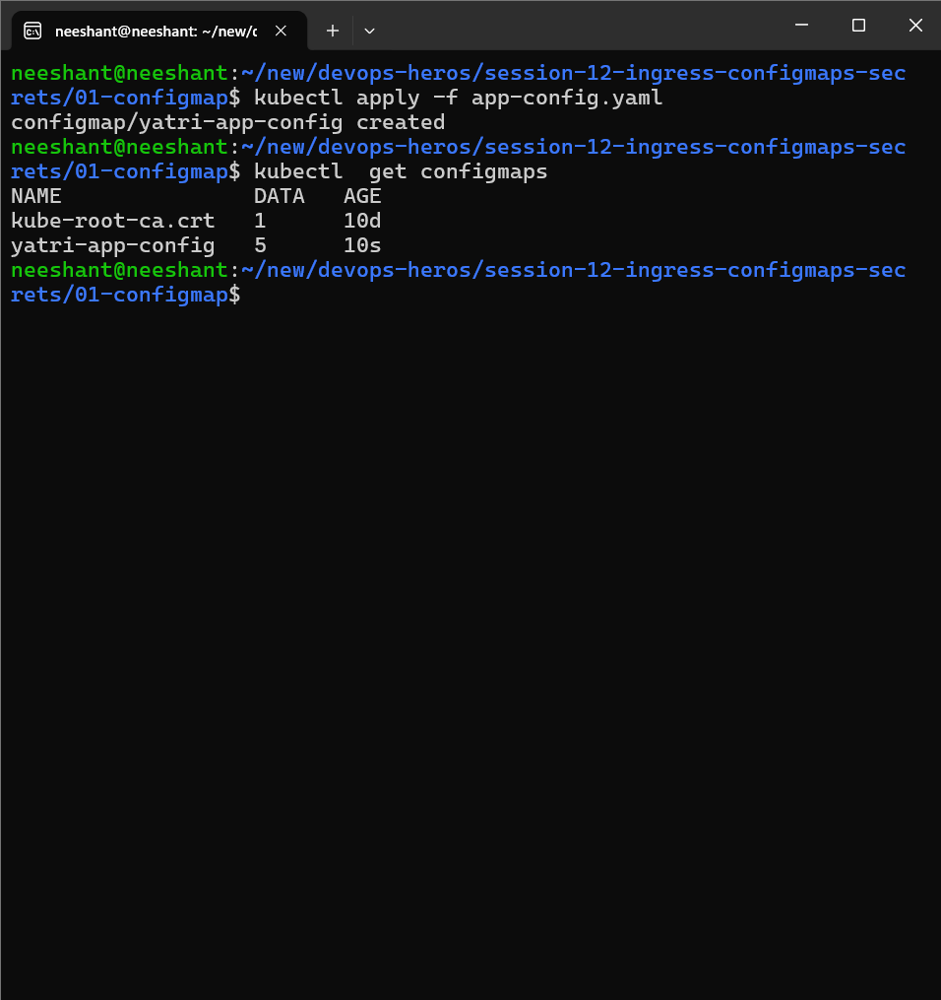
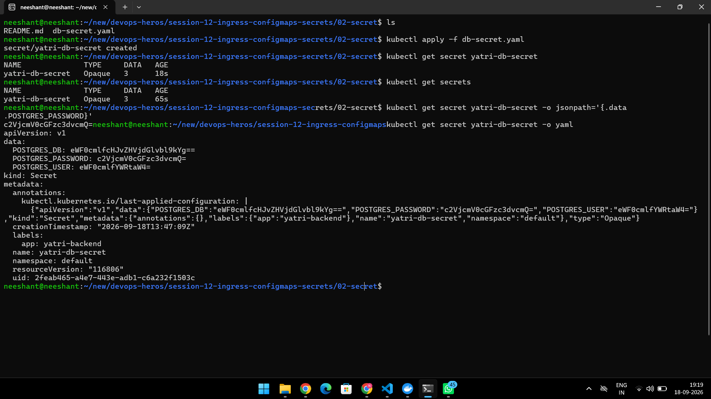
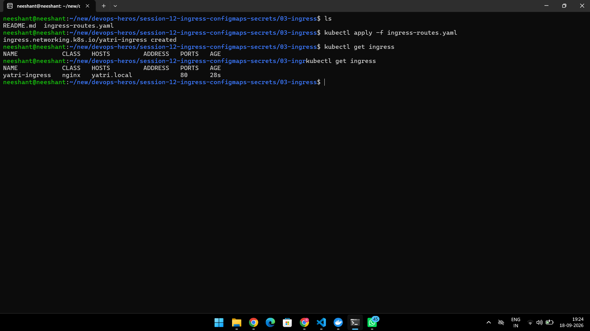

# Session 12 — Ingress, ConfigMaps & Secrets

Master guide for ConfigMaps, Secrets, Ingress + full demo (ConfigMap + Secret + Ingress working together).
Sub-guides: [01-configmap](./01-configmap/README.md) · [02-secret](./02-secret/README.md) · [03-ingress](./03-ingress/README.md) · [04-full-demo](./04-full-demo/README.md) · Lab: [lab.md](./lab.md) · Gotcha: [troubleshooting/secret-base64-gotcha.md](./troubleshooting/secret-base64-gotcha.md)

## Repo structure

```text
session-12-ingress-configmaps-secrets/
├── 01-configmap/        # Task 1 — ConfigMap theory + app-config.yaml
│   ├── README.md
│   ├── app-config.yaml / app-config.yml
│   └── screenshots/configmaps.png
├── 02-secret/           # Task 2 — Secret theory + db-secret.yaml
│   ├── README.md
│   ├── db-secret.yaml
│   └── screenshots/secret.png
├── 03-ingress/          # Task 3 — Ingress theory + routing YAMLs
│   ├── README.md
│   ├── ingress-routes.yaml / ingress-tls.yaml / path-based.yml
│   └── screenshots/ingress.png
├── 04-full-demo/        # Task 4 — frontend + backend behind one Ingress
│   ├── README.md
│   ├── configmap.yaml / secret.yaml / frontend.yaml / backend.yaml / ingress.yaml
│   └── run-demo.sh / cleanup.sh
├── troubleshooting/secret-base64-gotcha.md  # Task 5 — trailing-newline post-mortem
├── app/backend-with-config.yaml
└── lab.md               # step-by-step lab (Parts 1–9 + checklist)
```

---

## Task 1 — ConfigMap (non-sensitive config)

> Full notes: [01-configmap/README.md](./01-configmap/README.md)

A Kubernetes object used to store **non-sensitive** configuration data as key-value pairs.
Solves hardcoded config in images (`LOG_LEVEL = "DEBUG"` baked into `v1` image → rebuild for every env).
Follows 12-Factor: same image everywhere, only config changes per env.

Key points:

- Non-sensitive only (log levels, ports, feature flags, URLs). Never passwords.
- Consumed as env vars (`envFrom: configMapRef`) or mounted files (e.g. `nginx.conf`).
- Update does NOT auto-restart pods — `kubectl rollout restart` needed (see lab Part 9).
- 1 MiB size limit.

```bash
kubectl apply -f 01-configmap/app-config.yaml
kubectl get configmap yatri-app-config
kubectl describe configmap yatri-app-config
kubectl get configmap yatri-app-config -o jsonpath='{.data.LOG_LEVEL}'
# → INFO
kubectl delete configmap yatri-app-config
```

### Screenshot



---

## Task 2 — Secret (sensitive credentials)

> Full notes: [02-secret/README.md](./02-secret/README.md) · Gotcha: [troubleshooting/secret-base64-gotcha.md](./troubleshooting/secret-base64-gotcha.md)

A Kubernetes object used to store **sensitive** data such as passwords, tokens, and API keys.
Values are **Base64-encoded** (`echo -n "secretpassword" | base64` → `c2VjcmV0cGFzc3dvcmQ=`).

Key points:

- **Base64 is NOT encryption** — it is encoding. Protect with RBAC + etcd encryption-at-rest; production uses Vault / AWS Secrets Manager / External Secrets Operator.
- Always `echo -n` (no trailing newline) — `echo "x" | base64` embeds `\n` (`...Ao=`) and causes silent auth failures.
- Inject via `secretKeyRef` env vars or volume-mounted files (TLS keys). `kubectl describe secret` masks values.
- `etcd` encryption-at-rest is a CIS Benchmark requirement.

```bash
echo -n "yatri_admin" | base64        # → eWF0cmlfYWRtaW4=
echo -n "secretpassword" | base64    # → c2VjcmV0cGFzc3dvcmQ=
kubectl apply -f 02-secret/db-secret.yaml
kubectl get secret yatri-db-secret
kubectl get secret yatri-db-secret -o jsonpath='{.data.POSTGRES_PASSWORD}' | base64 --decode
# → secretpassword
kubectl delete secret yatri-db-secret
```

### Screenshot



---

## Task 3 — Ingress (external HTTP/HTTPS routing)

> Full notes: [03-ingress/README.md](./03-ingress/README.md)

A Kubernetes object that manages **external HTTP/HTTPS access** to in-cluster Services using routing rules.

Without Ingress: one cloud LoadBalancer per Service (~$25/mo each). With Ingress: one LB → NGINX Ingress Controller → path/host routing (`yatri.local/` → frontend, `yatri.local/api/*` → backend).

Key points:

- `Ingress` is just rules — you MUST install a controller (`minikube addons enable ingress`, or `ingress-nginx` via Helm on EKS).
- Layer 7 routing by host (`api.shop.com`) and path (`/orders`). Handles TLS termination centrally.
- `ingressClassName: nginx` is required (v1.18+); without it rules are silently ignored.
- `rewrite-target: /$2` strips the `/api` prefix before forwarding to the backend.

```bash
minikube addons enable ingress
kubectl apply -f 03-ingress/ingress-routes.yaml
kubectl get ingress yatri-ingress
kubectl describe ingress yatri-ingress
# NAME            CLASS   HOSTS        ADDRESS        PORTS   AGE
# yatri-ingress   nginx   yatri.local  192.168.49.2   80      12s
kubectl delete ingress yatri-ingress
```

### Screenshot



---

## Task 4 — Ingress vs Ingress Controller + Full Demo

> Full demo: [04-full-demo/README.md](./04-full-demo/README.md) · Lab Parts 1–9: [lab.md](./lab.md)

**Ingress vs Controller:** `Ingress` = declarative routing YAML (host/path → Service). `Ingress Controller` = running reverse-proxy pod (e.g. NGINX) that watches Ingress objects and actually forwards traffic. No controller → Ingress does nothing.

Demo topology:

```text
Browser → http://yatri.local/ → NGINX Ingress → frontend ClusterIP (reads ConfigMap)
        → http://yatri.local/api/ → NGINX Ingress → backend ClusterIP (reads ConfigMap + Secret)
```

| File | Purpose |
|------|---------|
| `configmap.yaml` | 5 plain-text keys (`ENVIRONMENT`, `LOG_LEVEL`, …) |
| `secret.yaml` | Base64 DB credentials |
| `frontend.yaml` | Nginx Deployment + ClusterIP Service, `envFrom: configMapRef` |
| `backend.yaml` | Python HTTP Deployment + Service, `envFrom` + `secretKeyRef` |
| `ingress.yaml` | `/api/*` → backend, `/` → frontend |
| `run-demo.sh` / `cleanup.sh` | one-command deploy / teardown |

Manual run (or `bash 04-full-demo/run-demo.sh`):

```bash
minikube addons enable ingress
kubectl apply -f 04-full-demo/configmap.yaml
kubectl apply -f 04-full-demo/secret.yaml
kubectl apply -f 04-full-demo/frontend.yaml
kubectl apply -f 04-full-demo/backend.yaml
kubectl apply -f 04-full-demo/ingress.yaml
echo "$(minikube ip) yatri.local" | sudo tee -a /etc/hosts
curl http://yatri.local          # → Nginx welcome page
curl http://yatri.local/api/     # → ENVIRONMENT: production, POSTGRES_USER: yatri_admin, …
kubectl exec -it deploy/yatri-backend -- env | grep -E "ENVIRONMENT|LOG_LEVEL|POSTGRES"
bash 04-full-demo/cleanup.sh
```

No dedicated demo screenshots — verification is via `curl` + `kubectl exec env` output above (see `04-full-demo/README.md` for expected outputs).

---

## Task 5 — Troubleshooting

- **Trailing newline secret bug** ([troubleshooting/secret-base64-gotcha.md](./troubleshooting/secret-base64-gotcha.md), lab Part 8): `echo "pwd" | base64` encodes `pwd\n` → `FATAL: password authentication failed`. Fix: `echo -n "pwd" | base64`. Diagnose with `xxd` (look for `0a`) and `base64 --decode`.
- **ConfigMap update not picked up** (lab Part 9): env vars are frozen at container start. `kubectl patch configmap …` then `kubectl rollout restart deployment/yatri-backend` + `rollout status`.
- **`CreateContainerConfigError`**: pod references a non-existent ConfigMap/Secret in `envFrom` — check names with `kubectl get configmap,secret`.
- **Ingress has no ADDRESS / 404**: controller not installed (`kubectl get pods -n ingress-nginx`), missing `ingressClassName: nginx`, or missing `/etc/hosts` entry for `yatri.local`.
- **Password leaked in logs**: backend intentionally never prints `POSTGRES_PASSWORD` — verify with `kubectl exec … -- env` only during debugging, never log secrets.
