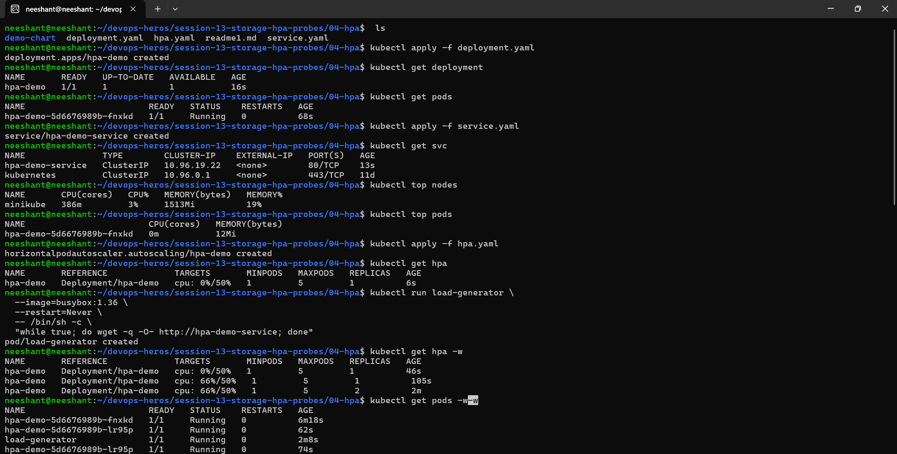
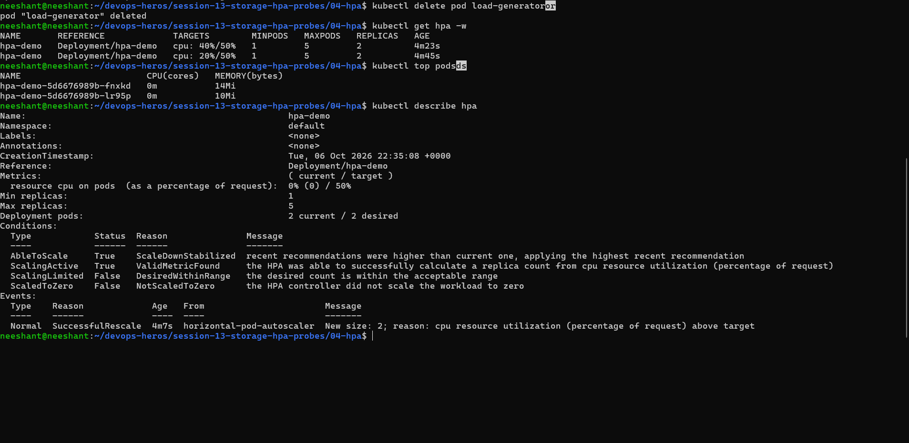
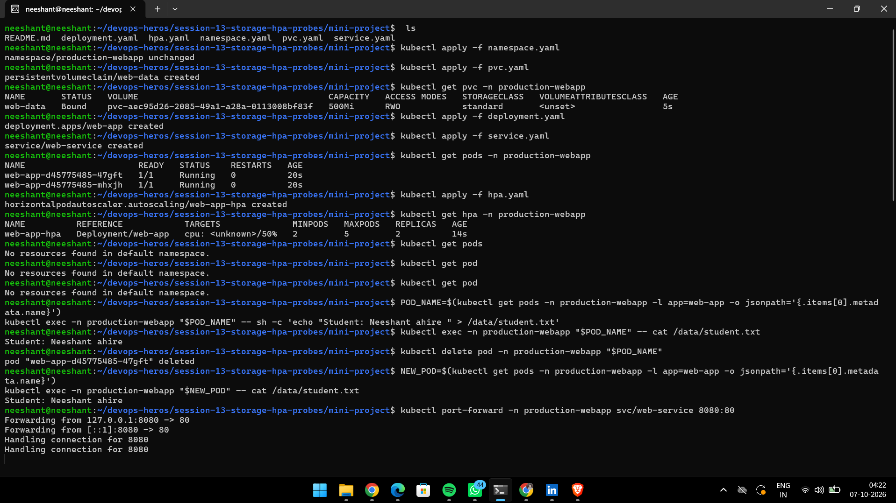
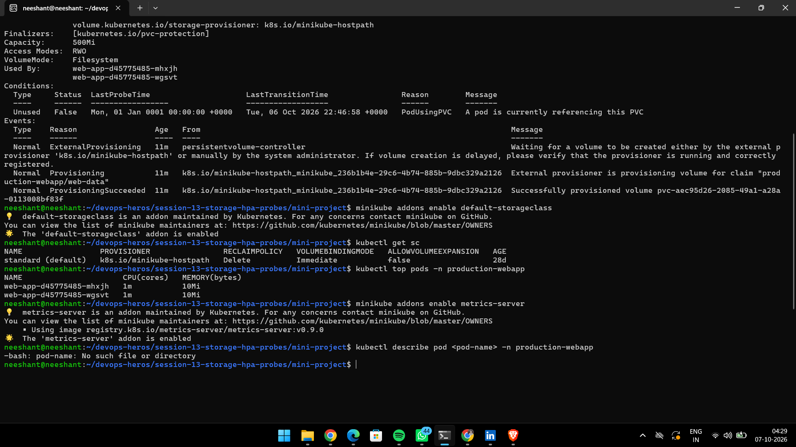
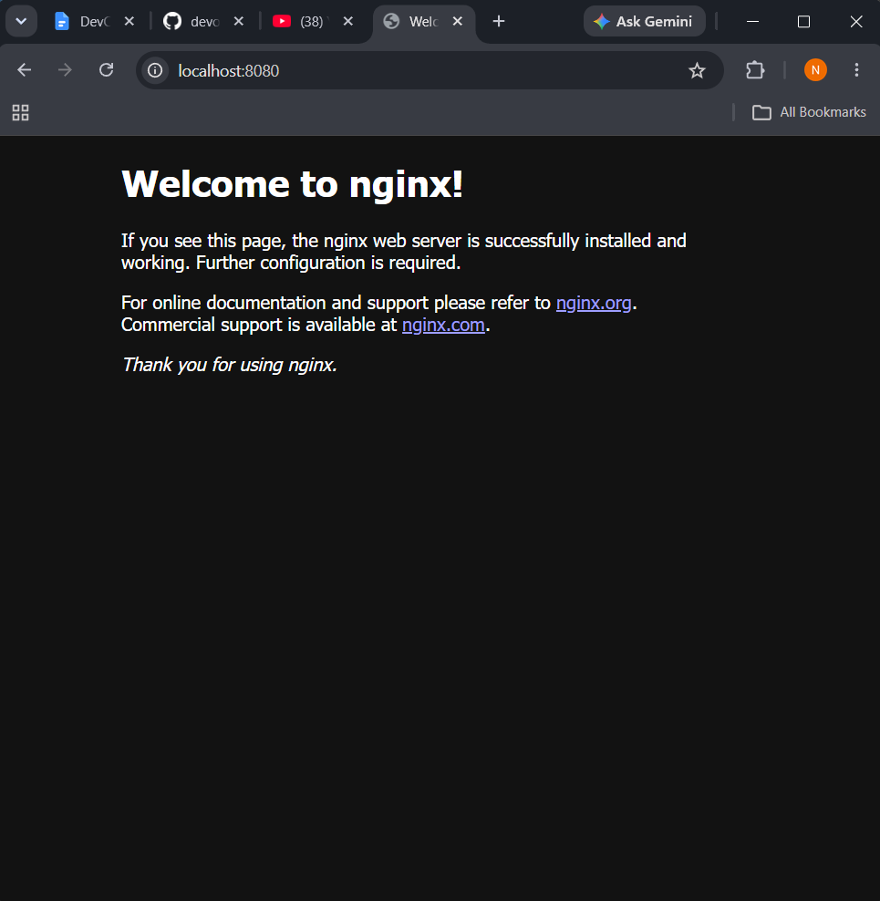
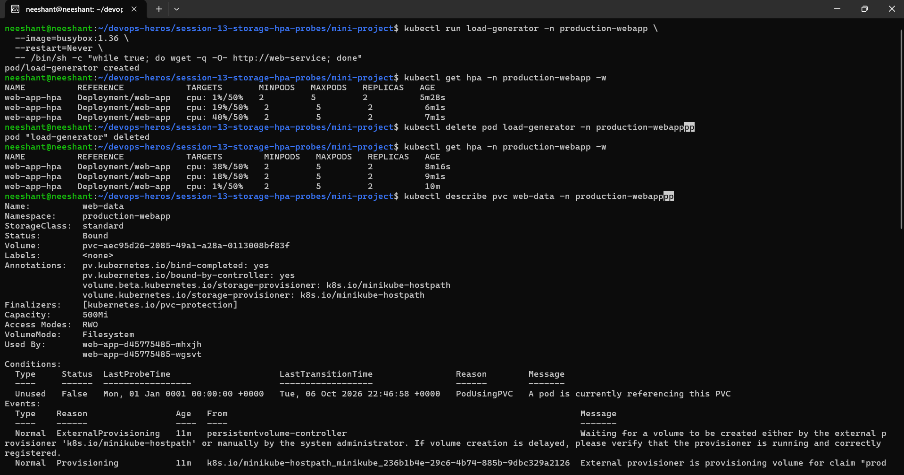

# Session 13 — Storage, HPA & Probes

Hands-on Kubernetes storage, autoscaling, and health-checking: Volumes (`emptyDir`, `hostPath`), Persistent Storage (PV/PVC), StorageClass + dynamic provisioning, HPA, and Liveness/Readiness/Startup probes, capped by a production-style mini-project.

## Repo Structure

```text
session-13-storage-hpa-probes/
├── 01-volumes/              # emptyDir + hostPath demos + docs
│   ├── README.md            # Task 1 volume learnings
│   ├── volume.md            # Detailed volume walkthrough
│   ├── emptydir-pod.yaml
│   └── hostpath-pod.yaml
├── 02-persistent-storage/   # Static PV → PVC → Pod binding
│   ├── readme1.md
│   ├── pv.yaml
│   ├── pvc.yaml
│   └── pod.yaml
├── 03-storageclass/          # Dynamic provisioning via StorageClass
│   ├── readme1.md
│   └── pvc.yaml
├── 04-hpa/                  # HPA demo (Deployment + Service + HPA)
│   ├── readme1.md
│   ├── deployment.yaml
│   ├── service.yaml
│   └── hpa.yaml
├── 05-probes/               # Liveness / Readiness / Startup probes
│   ├── probes.md
│   ├── liveness.yaml
│   ├── readiness.yaml
│   └── startup.yaml
├── mini-project/            # Production-ready web app (PVC + HPA + probes)
│   ├── README.md
│   ├── namespace.yaml
│   ├── pvc.yaml
│   ├── deployment.yaml
│   ├── service.yaml
│   └── hpa.yaml
└── screenshots/
    ├── task2/               # HPA evidence
    └── task3/               # Mini-project evidence
```

---

## Task 1 — Volumes (emptyDir, hostPath, PV, PVC, StorageClass, Dynamic Provisioning)

> Full write-up: [01-volumes/README.md](./01-volumes/README.md) · detailed guide [01-volumes/volume.md](./01-volumes/volume.md) · PV/PVC [02-persistent-storage/readme1.md](./02-persistent-storage/readme1.md) · StorageClass [03-storageclass/readme1.md](./03-storageclass/readme1.md) · Probes [05-probes/probes.md](./05-probes/probes.md)

Core idea: container filesystem is ephemeral — important data must live outside the container lifecycle.

```text
Temporary Data      →  emptyDir             (lifetime = Pod lifetime)
Node Storage        →  hostPath             (/tmp/hostpath-data on node, learning/testing only)
Persistent Storage  →  PV → PVC → Pod       (lifetime independent of Pod)
Automatic Storage   →  StorageClass → Dynamic Provisioning (PV auto-created on PVC)
```

### 1.1 emptyDir (Pod-scoped scratch)

`01-volumes/emptydir-pod.yaml` mounts `emptyDir: {}` at `/data`:

```bash
kubectl apply -f 01-volumes/emptydir-pod.yaml
kubectl get pods
kubectl exec -it emptydir-demo -- bash
echo "Hello Kubernetes" > /data/message.txt
cat /data/message.txt
exit
kubectl delete pod emptydir-demo
kubectl apply -f 01-volumes/emptydir-pod.yaml
kubectl exec emptydir-demo -- cat /data/message.txt
# cat: /data/message.txt: No such file or directory  → data gone with old Pod
```

### 1.2 hostPath (node directory into Pod)

`01-volumes/hostpath-pod.yaml` mounts node path `/tmp/hostpath-data`:

```yaml
volumes:
  - name: host-storage
    hostPath:
      path: /tmp/hostpath-data
      type: DirectoryOrCreate
```

Useful for learning / local testing / node-level cases — not first choice for production app storage.

### 1.3 PV + PVC (persistent app data)

Flow in `02-persistent-storage/`:

```text
PV (1Gi, RWO, Retain — cluster storage)
 │
 ▼
PVC (500Mi, RWO — storage request → Bound to PV)
 │
 ▼
Pod (mounts PVC at /data — data survives Pod delete/recreate)
```

```bash
kubectl apply -f 02-persistent-storage/pv.yaml
kubectl get pv
# NAME         CAPACITY   ACCESS MODES   RECLAIM POLICY   STATUS
# student-pv   1Gi        RWO            Retain           Available

kubectl apply -f 02-persistent-storage/pvc.yaml
kubectl get pvc
# NAME          STATUS   VOLUME
# student-pvc   Bound    student-pv

kubectl apply -f 02-persistent-storage/pod.yaml
kubectl get pods
kubectl exec -it storage-demo -- bash
echo "Kubernetes Storage" > /data/message.txt
cat /data/message.txt
exit
kubectl delete pod storage-demo
kubectl apply -f 02-persistent-storage/pod.yaml
kubectl exec storage-demo -- cat /data/message.txt
# Kubernetes Storage  → survives Pod replacement
```

Access modes: `RWO` (one node read/write), `ROX` (many nodes read-only), `RWX` (many nodes read/write), `RWOP` (single Pod read/write).

### 1.4 StorageClass + Dynamic Provisioning

Manual PV per developer doesn't scale (100 devs → 100 manual PVs). `03-storageclass/` solves it:

```text
PVC → StorageClass (e.g. standard/k8s.io/minikube-hostpath) → Provisioner → auto-created PV
```

```bash
kubectl get storageclass
# NAME                 PROVISIONER
# standard (default)   k8s.io/minikube-hostpath

kubectl describe storageclass standard
kubectl apply -f 03-storageclass/pvc.yaml   # dynamic-pvc, 500Mi, storageClassName: standard
kubectl get pvc
# NAME          STATUS   VOLUME
# dynamic-pvc   Bound    pvc-xxxxxxxx
kubectl get pv   # dynamically provisioned PV appears — no manual pv.yaml needed
kubectl describe pvc dynamic-pvc
```

---

## Task 2 — HPA Practical

> Full walkthrough: [04-hpa/readme1.md](./04-hpa/readme1.md) · manifests: `04-hpa/deployment.yaml`, `service.yaml`, `hpa.yaml`

HPA (`HorizontalPodAutoscaler`) scales replica count on CPU (via Metrics Server), 1 → 5 at 50% target in this demo (`averageUtilization: 50`, `requests.cpu: 100m`).

```bash
# Deploy
kubectl apply -f 04-hpa/deployment.yaml
kubectl apply -f 04-hpa/service.yaml
kubectl get deployment
kubectl get pods
kubectl get svc
# NAME               TYPE        CLUSTER-IP
# hpa-demo-service   ClusterIP   ...

# Metrics Server (required for HPA + top)
minikube addons enable metrics-server
kubectl get pods -n kube-system   # look for metrics-server-xxxxx
kubectl top nodes
kubectl top pods

# HPA
kubectl apply -f 04-hpa/hpa.yaml
kubectl get hpa
# NAME       TARGETS   MINPODS   MAXPODS   REPLICAS
# hpa-demo   0%/50%    1         5         1
kubectl describe hpa hpa-demo

# Load test
kubectl run load-generator \
  --image=busybox:1.36 \
  --restart=Never \
  -- /bin/sh -c "while true; do wget -q -O- http://hpa-demo-service; done"

kubectl get hpa -w
kubectl get pods -w
kubectl top pods

# Stop load → replicas scale back down after stabilization
kubectl delete pod load-generator
kubectl get hpa -w
```

Flow:

```text
Application → CPU usage → Metrics Server → HPA → Deployment → More/fewer Pods
```

### Screenshots

HPA in action (replicas scaling under load):





---

## Task 3 — Mini-Project: Production-Ready Web App

> Full guide: [mini-project/README.md](./mini-project/README.md)

Combines all three pillars in namespace `production-webapp`:

```text
[ Service: web-service :80 ]
   ├── Pod web-app-1/2/N (probes + cpu: 100m + /data → PVC web-data 500Mi RWO)
   ├── HPA web-app-hpa (min 2, max 5, 50% CPU) ← Metrics Server
   └── PVC web-data → StorageClass standard → host persistent storage
```

| Probe | Question | On failure |
|---|---|---|
| Startup | Has the app finished starting? | Container may restart; gates other probes |
| Readiness | Ready for traffic? | Pod `NotReady`, removed from Service endpoints (no restart) |
| Liveness | Still alive? | Container restarted |

Deploy + verify:

```bash
kubectl apply -f mini-project/namespace.yaml
kubectl apply -f mini-project/pvc.yaml
kubectl get pvc -n production-webapp
kubectl apply -f mini-project/deployment.yaml
kubectl apply -f mini-project/service.yaml
kubectl get pods -n production-webapp
kubectl apply -f mini-project/hpa.yaml
kubectl get hpa -n production-webapp
# NAME          REFERENCE            TARGETS   MINPODS   MAXPODS   REPLICAS
# web-app-hpa   Deployment/web-app   0%/50%    2         5         2

# 1. Persistence: write /data/student.txt, delete pod, re-read — data intact
# 2. Service: kubectl port-forward -n production-webapp svc/web-service 8080:80 && curl http://localhost:8080
# 3. HPA: busybox load-generator vs web-service, watch kubectl get hpa -n production-webapp -w
```

See [mini-project/README.md](./mini-project/README.md) for exact verification steps, expected outputs, troubleshooting (PVC `Pending`, HPA `<unknown>/50%`, `CrashLoopBackOff`), and bonus challenges (target tuning, breaking readiness/liveness).

### Screenshots

Setup / deployment:



Storage + service verification:



Browser check (`port-forward` + `curl`/browser):



HPA / terminal evidence:



---

## Probes — Liveness / Readiness / Startup

> Full notes: [05-probes/probes.md](./05-probes/probes.md) · manifests: `05-probes/liveness.yaml`, `readiness.yaml`, `startup.yaml`

A Pod can be `Running` while the app inside is broken — probes let kubelet check the app:

| Probe | Question | On failure |
|---|---|---|
| Liveness (`05-probes/liveness.yaml`) | Still alive? | Container restarted |
| Readiness (`05-probes/readiness.yaml`) | Ready for traffic? | Pod `NotReady`, removed from Service endpoints (no restart) |
| Startup (`05-probes/startup.yaml`) | Finished slow start? | Gates liveness/readiness until success (for 30s+ boot apps) |

```bash
kubectl apply -f 05-probes/liveness.yaml
kubectl get pod liveness-demo
kubectl describe pod liveness-demo   # look for Liveness probe events
kubectl apply -f 05-probes/readiness.yaml
kubectl get pod readiness-demo       # Running but 0/1 READY until probe passes
kubectl apply -f 05-probes/startup.yaml
kubectl get pod startup-demo
```

Note: `hpa/` holds an alternate backend HPA variant (`hpa-backend.yaml`, `backend-service.yaml`, `load_generator.sh`) — the canonical HPA demo is `04-hpa/`.

---

## References

- Kubernetes Volumes: https://kubernetes.io/docs/concepts/storage/volumes/
- Persistent Volumes: https://kubernetes.io/docs/concepts/storage/persistent-volumes/
- Storage Classes: https://kubernetes.io/docs/concepts/storage/storage-classes/
- HPA: https://kubernetes.io/docs/concepts/workloads/autoscaling/horizontal-pod-autoscale/
- Probes: https://kubernetes.io/docs/concepts/workloads/pods/probes/
