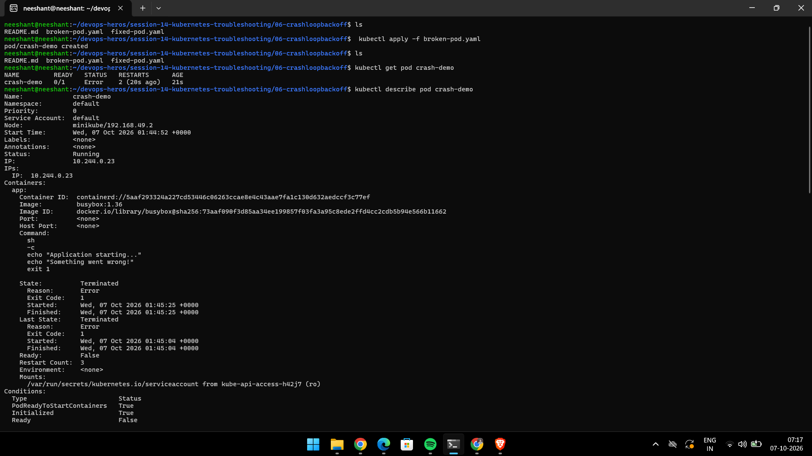
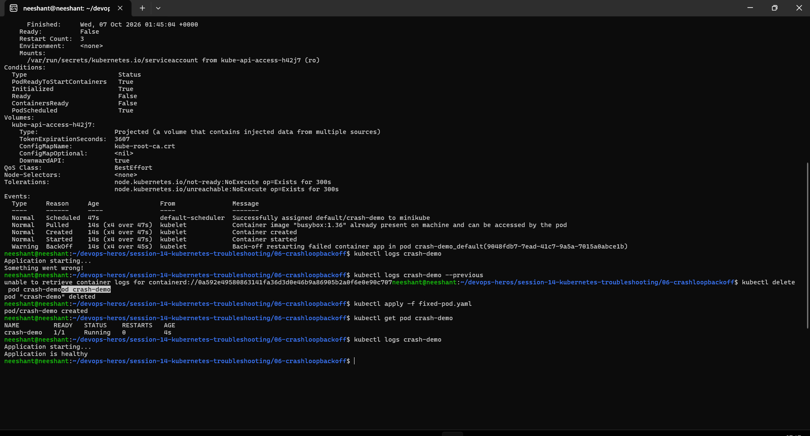
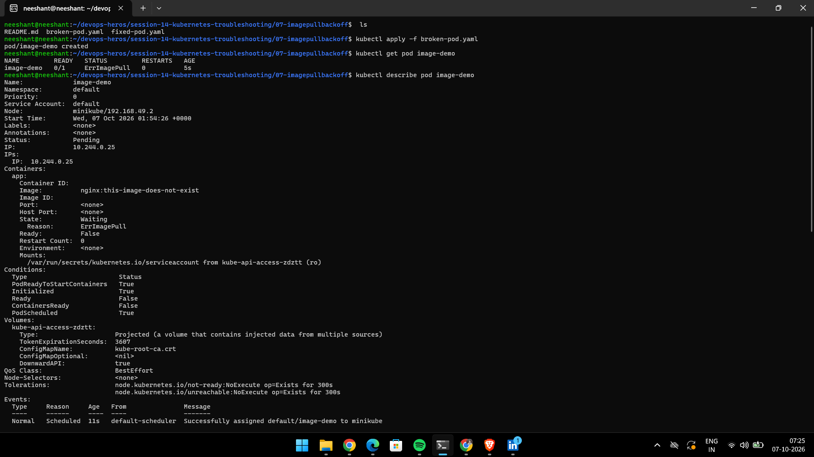
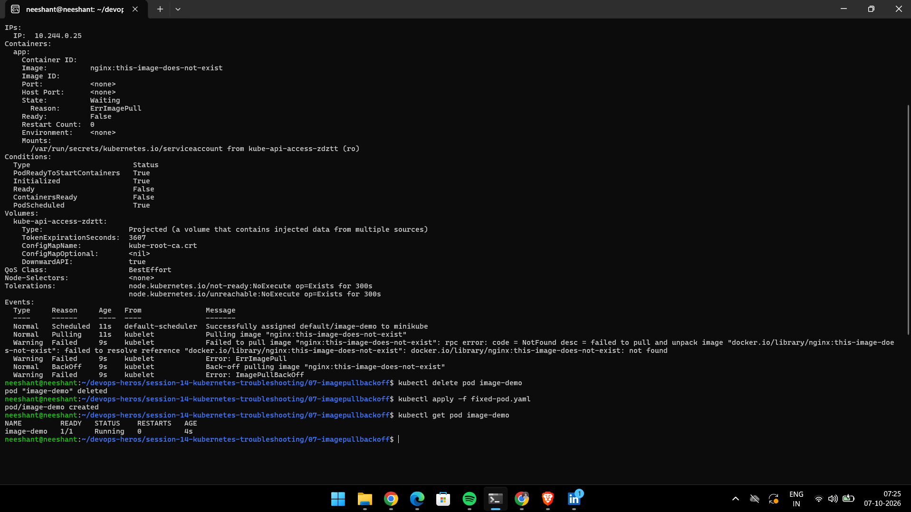
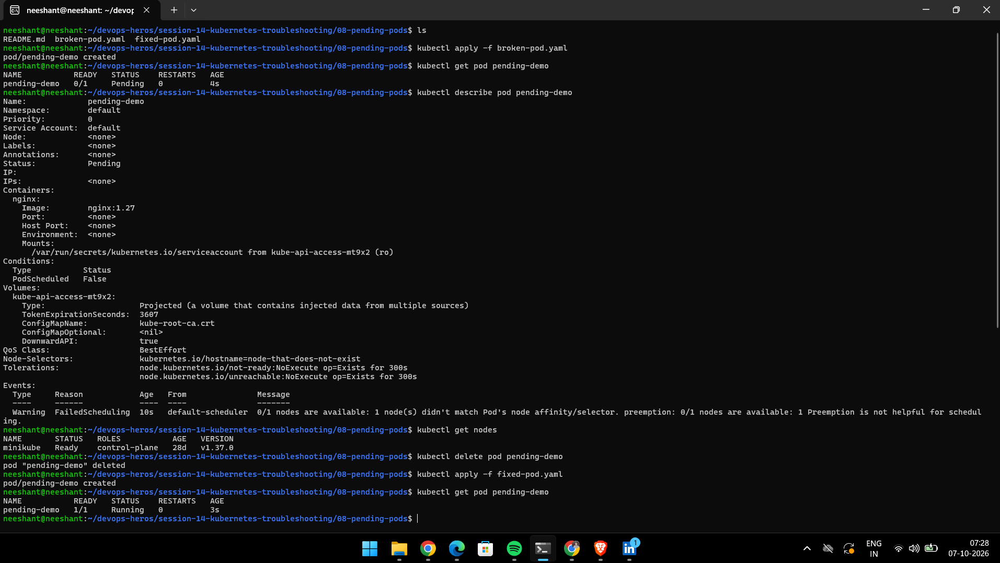
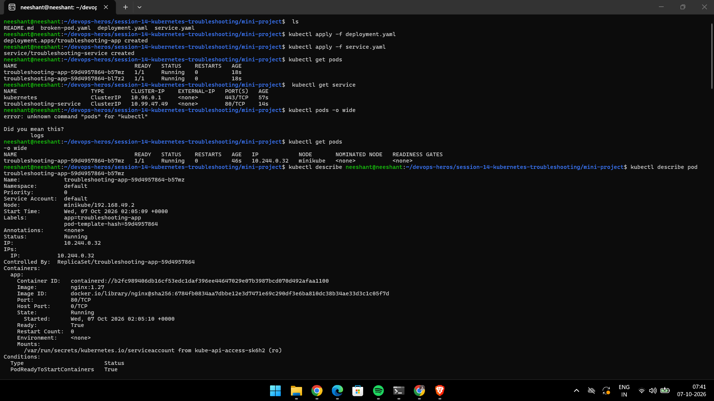
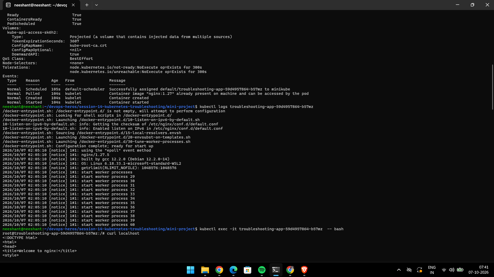
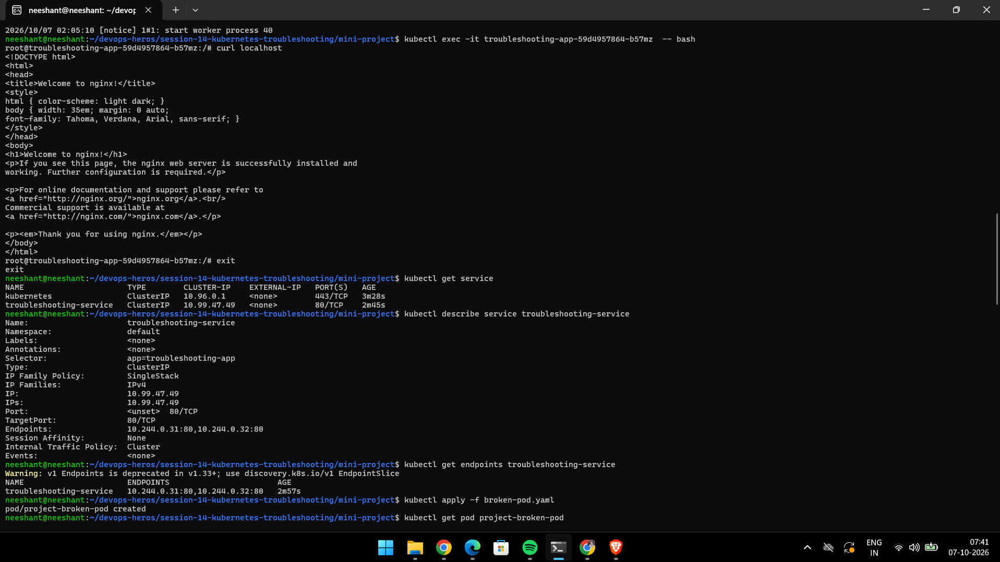
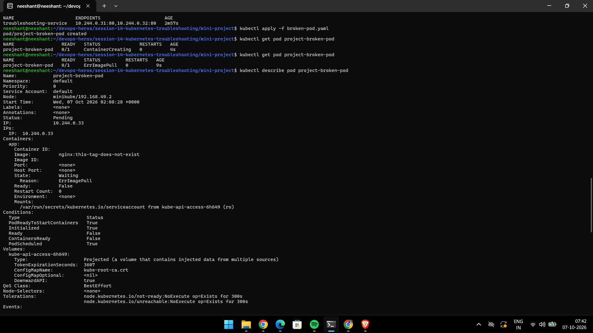
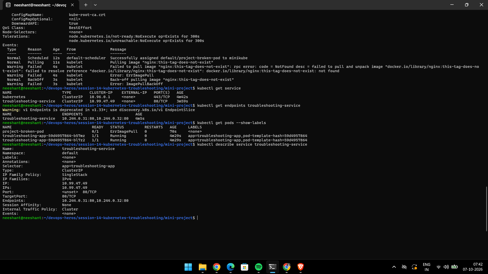

# Session 14 Assignment — Kubernetes Troubleshooting

Hands-on evidence for Task 1 (core commands), Task 2 (broken → fixed issues), Task 3 (mini-project).
Lab theory lives in the parent-topic guides: [01-kubectl-get](../01-kubectl-get/README.md) · [02-kubectl-describe](../02-kubectl-describe/README.md) · [03-kubectl-logs](../03-kubectl-logs/README.md) · [04-kubectl-exec](../04-kubectl-exec/README.md) · [05-events](../05-events/README.md) · [06-crashloopbackoff](../06-crashloopbackoff/README.md) · [07-imagepullbackoff](../07-imagepullbackoff/README.md) · [08-pending-pods](../08-pending-pods/README.md) · [09-service-dns-troubleshooting](../09-service-dns-troubleshooting/README.md), plus [mini-project](../mini-project/README.md) and [scenarios](../scenarios/).

## Task 1 — Core commands (`get`, `describe`, `logs`, `exec`, events)

```bash
kubectl get pods
kubectl get pods -o wide
kubectl describe pod <pod-name>
kubectl logs <pod-name>
kubectl logs <pod-name> --previous
kubectl exec -it <pod-name> -- bash
kubectl get events --sort-by=.lastTimestamp
```

Debug order: `get` → `describe` (Events section) → `logs` → `exec` → `events`.

### Screenshots

kubectl get:


kubectl describe:


kubectl logs:


kubectl exec:


kubectl events:


Miscellaneous commands:


---

## Task 2 — Broken → fixed issues

General triage per issue: `kubectl get pods` (status) → `kubectl describe pod` (Events/ExitCode) → `kubectl logs [--previous]` → fix YAML → `kubectl apply` → verify `Running`.

### CrashLoopBackOff (`06-crashloopbackoff`: bad command `exit 1` loop)

```bash
kubectl apply -f 06-crashloopbackoff/broken-pod.yaml
kubectl get pods                       # CrashLoopBackOff, RESTARTS climbing
kubectl logs crashloop-demo --previous # exit code 1
kubectl apply -f 06-crashloopbackoff/fixed-pod.yaml
kubectl get pods                       # Running
```





### ImagePullBackOff (`07-imagepullbackoff`: nonexistent image tag)

```bash
kubectl apply -f 07-imagepullbackoff/broken-pod.yaml
kubectl get pods                 # ImagePullBackOff
kubectl describe pod <pod>       # Failed to pull image / tag not found
# fix: change image tag to an existing tag (e.g. :latest)
kubectl apply -f 07-imagepullbackoff/fixed-pod.yaml
kubectl get pods                 # Running
```





### Pending (`08-pending-pods`: impossible CPU/memory request; see also `scenarios/scenario-3-pending/`)

```bash
kubectl apply -f 08-pending-pods/broken-pod.yaml
kubectl get pods                 # Pending
kubectl describe pod <pod>       # 0/1 nodes available: Insufficient cpu/memory
# fix: lower requests to fit the node
kubectl apply -f 08-pending-pods/fixed-pod.yaml
kubectl get pods                 # Running
```



### Service / DNS (`09-service-dns-troubleshooting`, `scenarios/scenario-4-dns-failure/`)

```bash
kubectl get svc,endpoints
kubectl describe svc <svc>       # selector mismatch → empty Endpoints
kubectl exec -it dns-test -- nslookup <svc-name>
# fix: align Service selector with Pod labels; verify Endpoints repopulate
```

(No dedicated assignment screenshots for service/DNS — see `09-service-dns-troubleshooting/` manifests and `scenarios/scenario-4-dns-failure/broken.yaml`. Other scenarios: `scenario-1-crashloop/`, `scenario-2-imagepull/`, `scenario-5-oomkilled/` with `triage_all.sh`. OOMKilled triage: `kubectl describe` shows `Reason: OOMKilled`, raise `resources.limits.memory`.)

---

## Task 3 — Mini-project (deploy → break → investigate → fix → verify)

> Manifests: [mini-project](../mini-project/README.md) (`deployment.yaml`, `service.yaml`, `broken-pod.yaml`)

```bash
kubectl apply -f ../mini-project/deployment.yaml
kubectl apply -f ../mini-project/service.yaml
kubectl get pods -o wide
kubectl describe pod <pod-name>
kubectl logs <pod-name>
kubectl exec -it <pod-name> -- bash
# inside: curl localhost  → expect Nginx response
kubectl get svc
```

Q&A from the run:

- Q1 Pod status? A: `ImagePullBackOff`.
- Q2 Actual error? A: image tag does not exist to pull.
- Q3 Which command found it? A: `kubectl get pods` / `kubectl get pods -o wide` (+ `describe` for the pull error).
- Q4 What is wrong with the image? A: the tag does not exist, so it cannot be pulled.
- Q5 Fix? A: change the tag to `latest` (an existing tag), re-apply, verify `Running`.

### Screenshots










