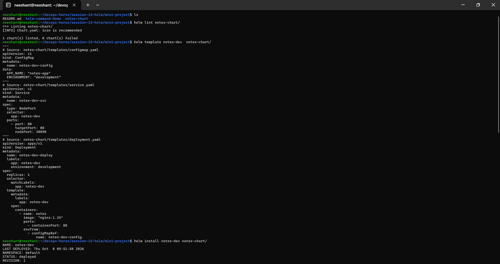
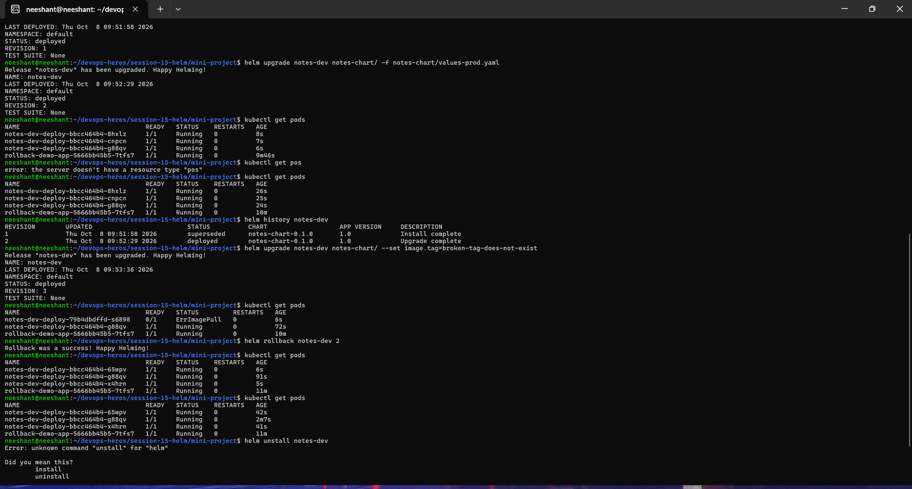

# Session 15 Assignment

## Task:

- Given to run the following commands:
  - helm create
  - helm install
  - helm list
  - helm status
  - helm get
  - helm upgrade
  - helm history
  - helm rollback
  - helm uninstall
  - helm repo
  - helm search

I also Did Task 2 which is roll over and Also ran the miniproject.
Screenshots of all 3 are given below

## Screenshots:

## Task 1:

## Task 2:

## Mini Project

