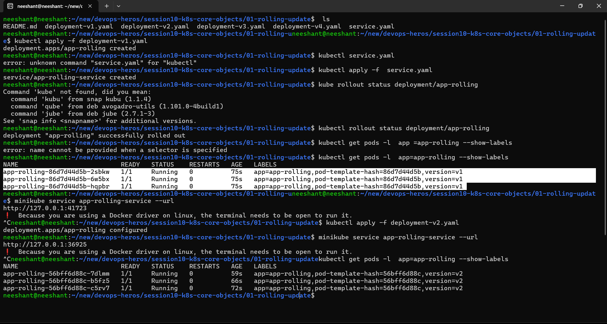
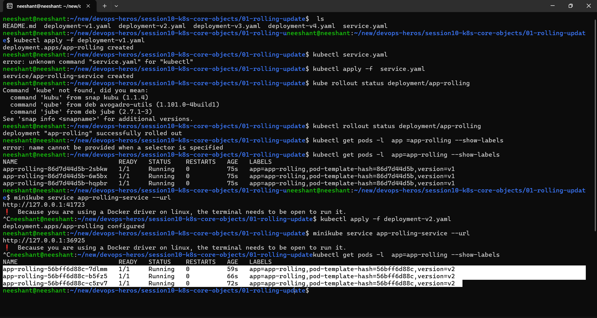
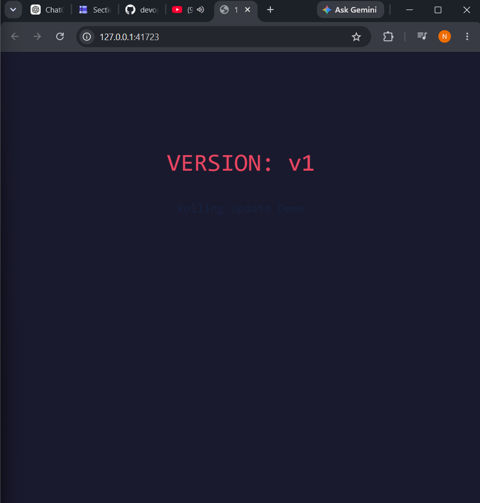
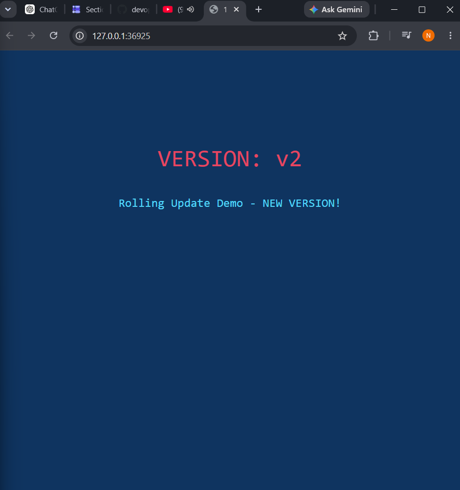
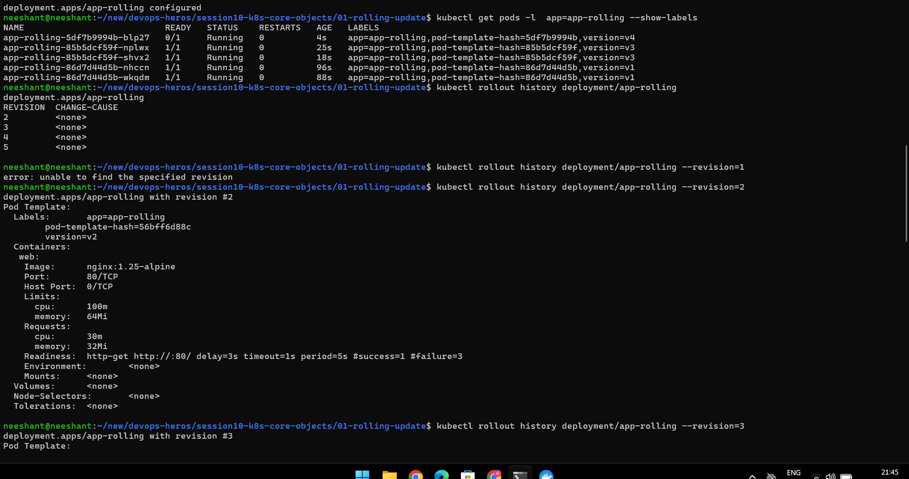
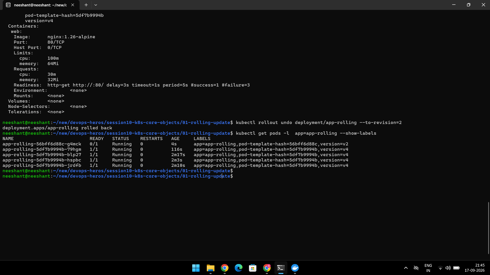

# Rolling Update:

1. **Rolling Update:** A rolling update gradually replaces the existing Pods with new Pods when a new version of the Deployment is released, allowing the application to remain available during the update.

2. **Normal Undo:** A normal undo rolls the Deployment back to the previous revision, allowing us to return to the version that was running immediately before the current one.

3. **Revision Undo:** A revision undo allows us to roll back the Deployment directly to a specific previous revision instead of only the immediately previous version.

**Images for the same are given below.**

---

# Screenshots:

