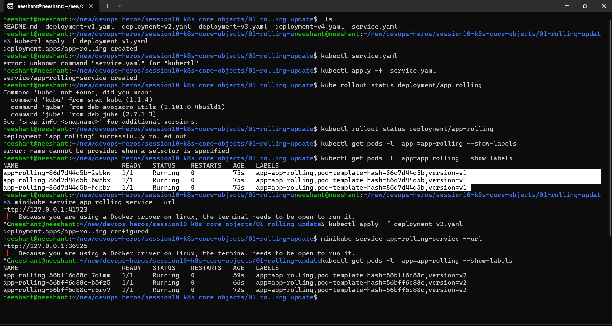
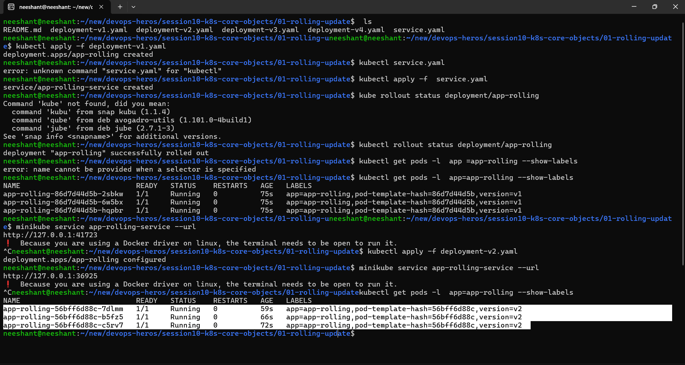
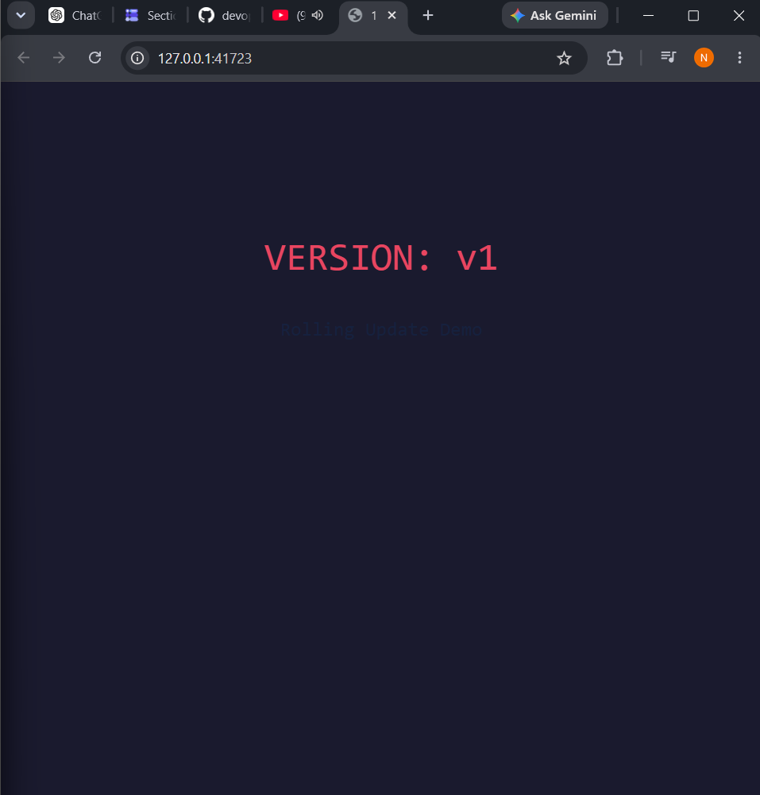
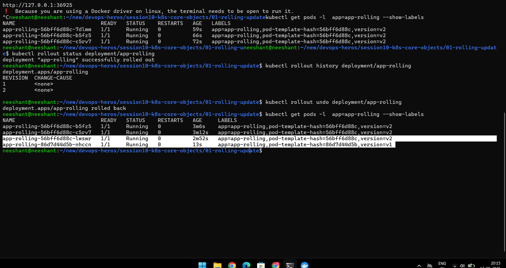
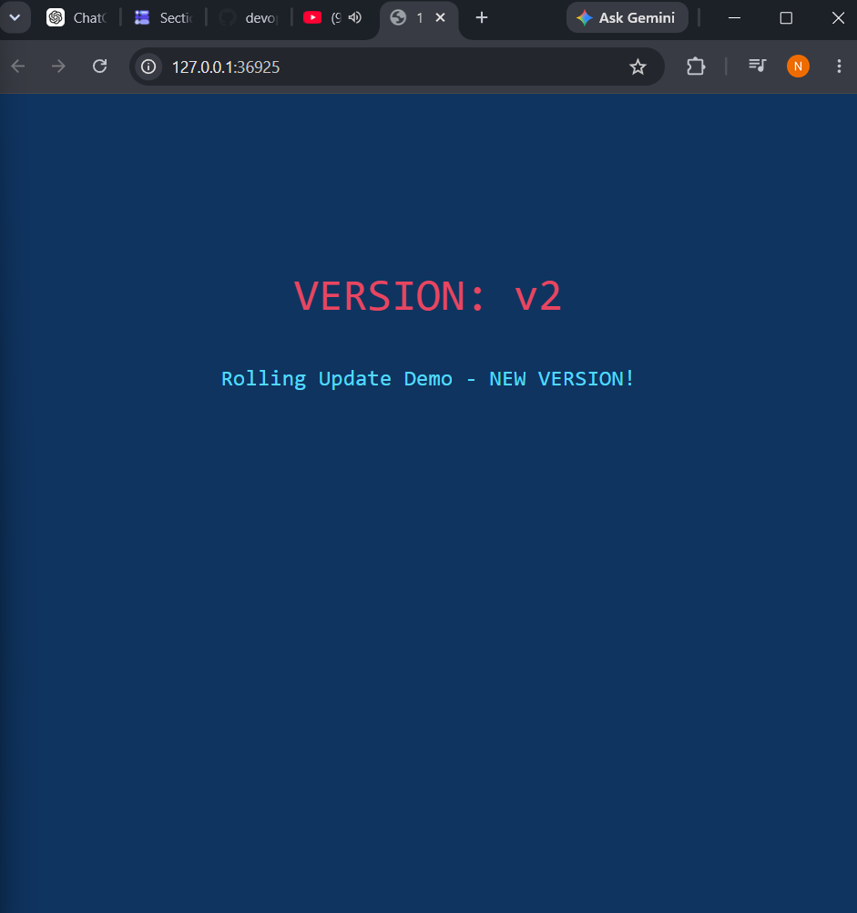
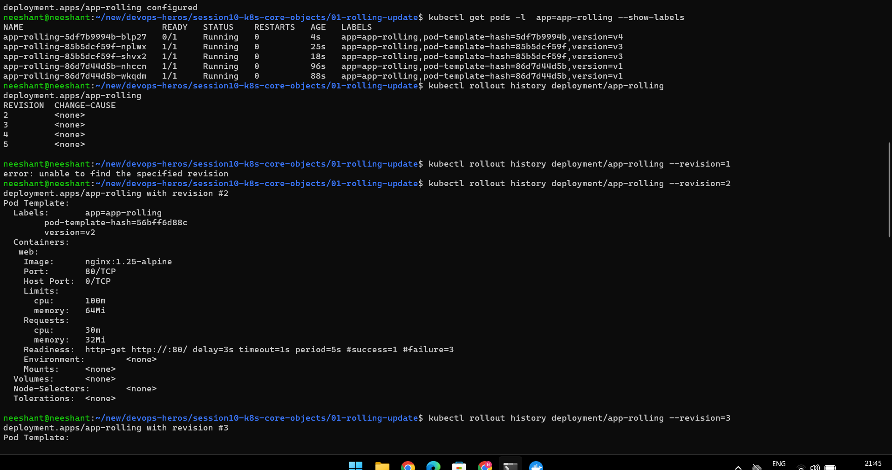
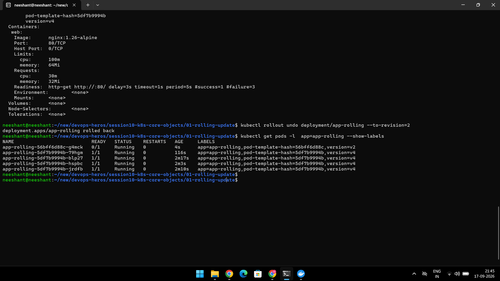

# Session 10: Kubernetes Core Objects — Deployment Strategies + Pod Lifecycle

Covers **Task 1** (4 deployment strategies) and **Task 2** (Pod lifecycle).
Detailed manifests, commands, and outputs live in the subfolders linked below.

## Task 1: Deployment Strategies

| # | Strategy | Folder | Downtime? | How it works |
|---|----------|--------|-----------|--------------|
| 1 | Rolling Update | [01-rolling-update](./01-rolling-update/) | No | Gradually replaces old Pods with new ones (`maxSurge` / `maxUnavailable`). Supports `kubectl rollout undo` and `--to-revision`. |
| 2 | Blue-Green | [02-blue-green](./02-blue-green/) | No | Runs Blue (live) + Green (new) side by side; switches Service selector to cut over; instant rollback by switching back. |
| 3 | Canary | [03-canary](./03-canary/) | No | Stable serves most traffic; small Canary pool gets a fraction of traffic for real-user validation, then scaled up. |
| 4 | Recreate | [04-recreate](./04-recreate/) | **Yes (brief outage)** | Kills **all** v1 Pods first, then creates v2. Required for breaking schema migrations, `ReadWriteOnce` volume locks, and resource-constrained envs. |

Full comparison matrix (from [04-recreate](./04-recreate/)):

| Strategy | Downtime? | Resource overhead | Rollback | Best for |
|----------|-----------|-------------------|----------|----------|
| RollingUpdate | Zero | Low (+25% surge) | Fast (`kubectl rollout undo`) | Default stateless apps |
| Blue-Green | Zero | High (200% capacity) | Instant (switch selector) | Mission-critical atomic cutover |
| Canary | Zero | Low (small canary pool) | Fast (scale canary to 0) | High-traffic real-user validation |
| Recreate | Yes | Zero (no surge) | Slower (kill v2, start v1) | Schema migrations, RWO locks, dev envs |

### 1. Rolling Update — [01-rolling-update](./01-rolling-update/)

- Gradual Pod replacement; app stays available during update.
- Normal undo rolls back to the immediately previous revision; revision undo (`--to-revision=N`) targets a specific revision.
- Manifests: `deployment-v1.yaml`, `deployment-v2.yaml`, `service.yaml`.
- See [01-rolling-update/README.md](./01-rolling-update/README.md).

### 2. Blue-Green — [02-blue-green](./02-blue-green/)

- **Blue** = live version serving traffic; **Green** = new version deployed separately and tested.
- Switch traffic Blue → Green once ready; switch back on failure.
- Manifests: `deployment-blue.yaml`, `deployment-green.yaml`, `service-blue.yaml`, `service-green.yaml`.
- See [02-blue-green/README.md](./02-blue-green/README.md).

### 3. Canary — [03-canary](./03-canary/)

- **Stable** serves most traffic; **Canary** gets a small slice for live testing.
- On success, grow canary until it becomes the main version; on failure, keep/return traffic to stable.
- Manifests: `deployment-stable.yaml`, `deployment-canary.yaml`, `service.yaml`.
- See [03-canary/README.md](./03-canary/README.md).

### 4. Recreate — [04-recreate](./04-recreate/)

- `strategy.type: Recreate` — terminates **all** v1 Pods, waits for zero running, then creates v2 (downtime window with 502 / connection refused).
- Use for: breaking DB schema migrations, `ReadWriteOnce` (EBS/GCP PD) volume locks, single-writer legacy apps, no-surge dev clusters.
- Demo: watch `kubectl get pods -l app=app-recreate -w` while applying `deployment-v2.yaml`; curl loop shows `VERSION: v1` → `[OUTAGE]` → `VERSION: v2 (UPGRADED)`.
- See [04-recreate/README.md](./04-recreate/README.md) for full step-by-step output (no screenshots in this folder; verification is via `curl http://localhost:30040` output).

---

## Task 2: Pod Lifecycle — [pod-lifecycle](./pod-lifecycle/)

12 independent manifests (`01-running.yaml` … `12-termination.yaml`) + [pod-lifecycle/README.md](./pod-lifecycle/README.md).

| # | Manifest | Phase / behaviour |
|---|----------|-------------------|
| 1 | `01-running.yaml` | Running (healthy) |
| 2 | `02-pending.yaml` | Pending (impossible CPU/memory request) |
| 3 | `03-succeeded.yaml` | Succeeded (`Completed`) |
| 4 | `04-failed.yaml` | Failed (`Error`) |
| 5 | `05-crashloopbackoff.yaml` | CrashLoopBackOff (exit 1 loop) |
| 6 | `06-imagepullbackoff.yaml` | ImagePullBackOff (nonexistent tag) |
| 7 | `07-readiness.yaml` | Readiness probe — Running ≠ Ready |
| 8 | `08-liveness.yaml` | Liveness probe — restarts container after 20s |
| 9 | `09-startup.yaml` | Startup probe — 30s slow start |
| 10 | `10-init-container.yaml` | Init container runs before main container |
| 11 | `11-multi-container.yaml` | Multi-container Pod (`2/2`, app + sidecar) |
| 12 | `12-termination.yaml` | Graceful termination (SIGTERM cleanup) |

Key teaching points (see sub-README):

- Official Pod phases are only `Pending / Running / Succeeded / Failed / Unknown`; values like `CrashLoopBackOff`, `ImagePullBackOff`, `Terminating` are container/kubectl states.
- Debug trio: `kubectl get pod <pod>` → `kubectl describe pod <pod>` → `kubectl logs <pod>`.
- Live watch: `kubectl get pods -w` while applying each YAML; ask: state? running? ready? restarted? why? which debug command?
