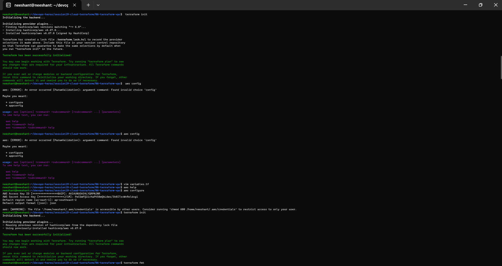
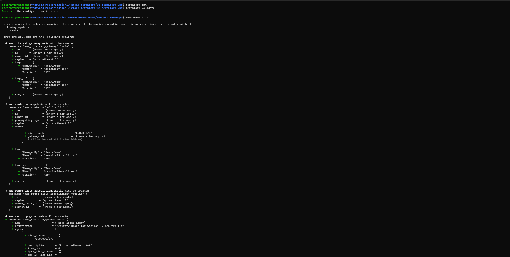
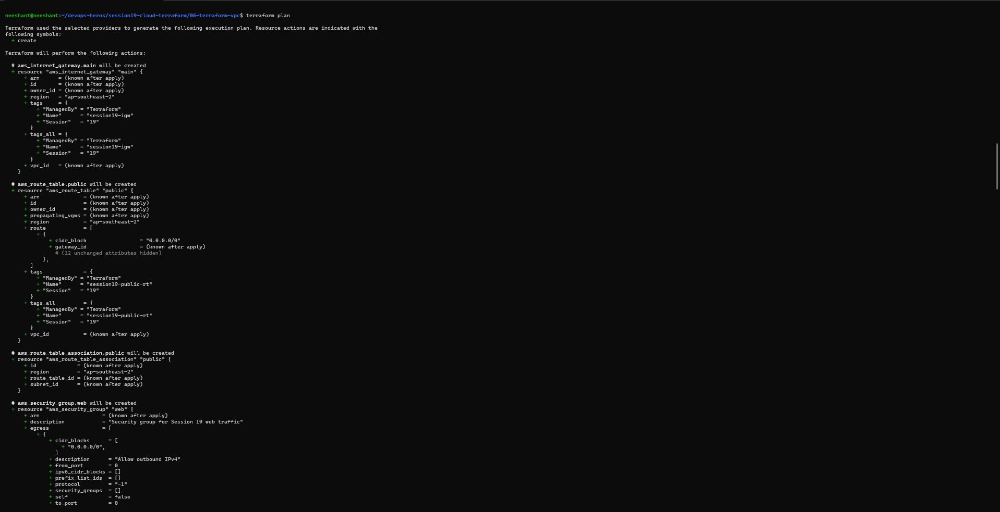
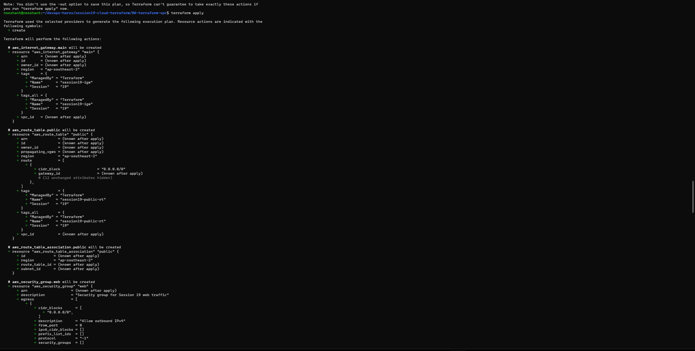
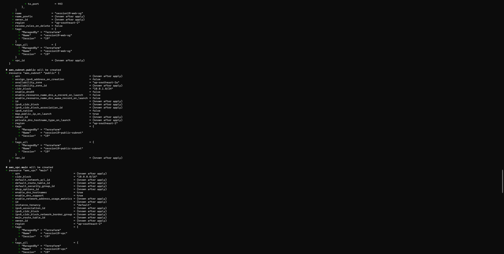
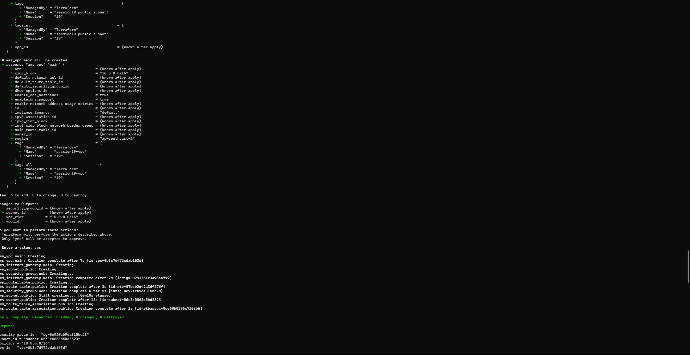

# Terraform & Infrastructure as Code

## Task 1:

- Task 1 was done during the class. The 
---

## Screenshots of Task 1:

---

## Task 2:

All the references for Task 2, all the readme are in the following files.

## Links:

- [IAC](./terraform-s3-demo/aws-service/01-iam/README.md)
- [EC2](./terraform-s3-demo/aws-service/02-ec2/README.md)
- [S3](./terraform-s3-demo/aws-service/03-s3/README.md)
- [VPC](./terraform-s3-demo/aws-service/04-vpc/README.md)
- [DYNAMODB-RDS](./terraform-s3-demo/aws-service/05-dynamodb/readme.md)