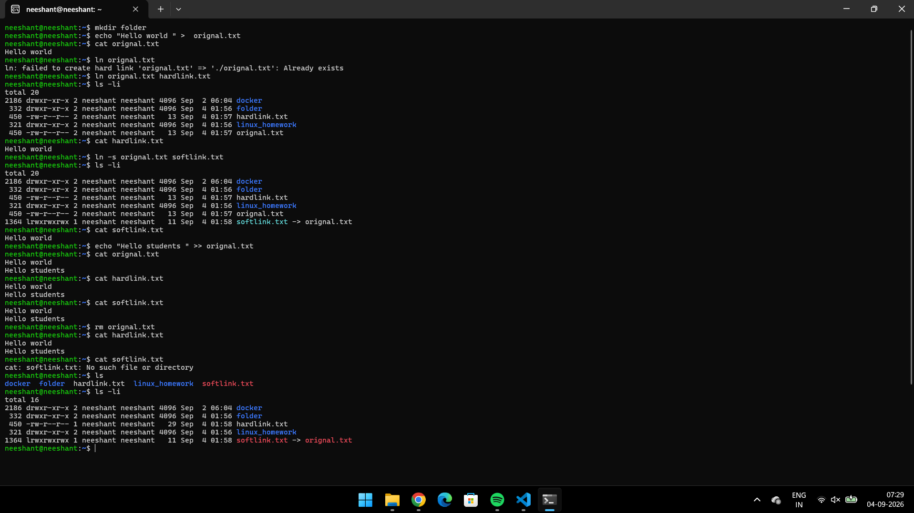
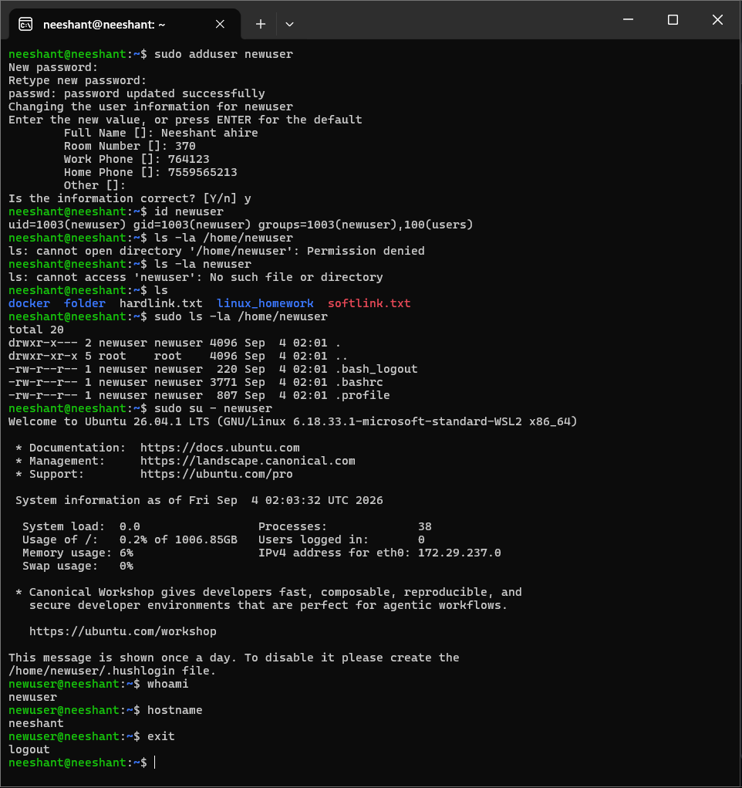
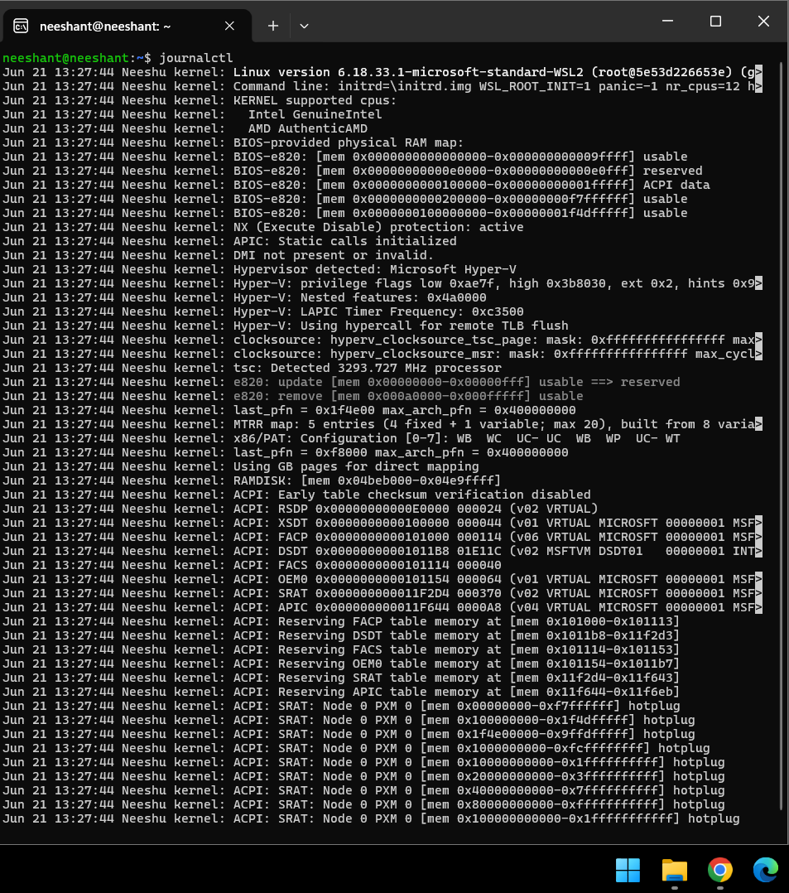
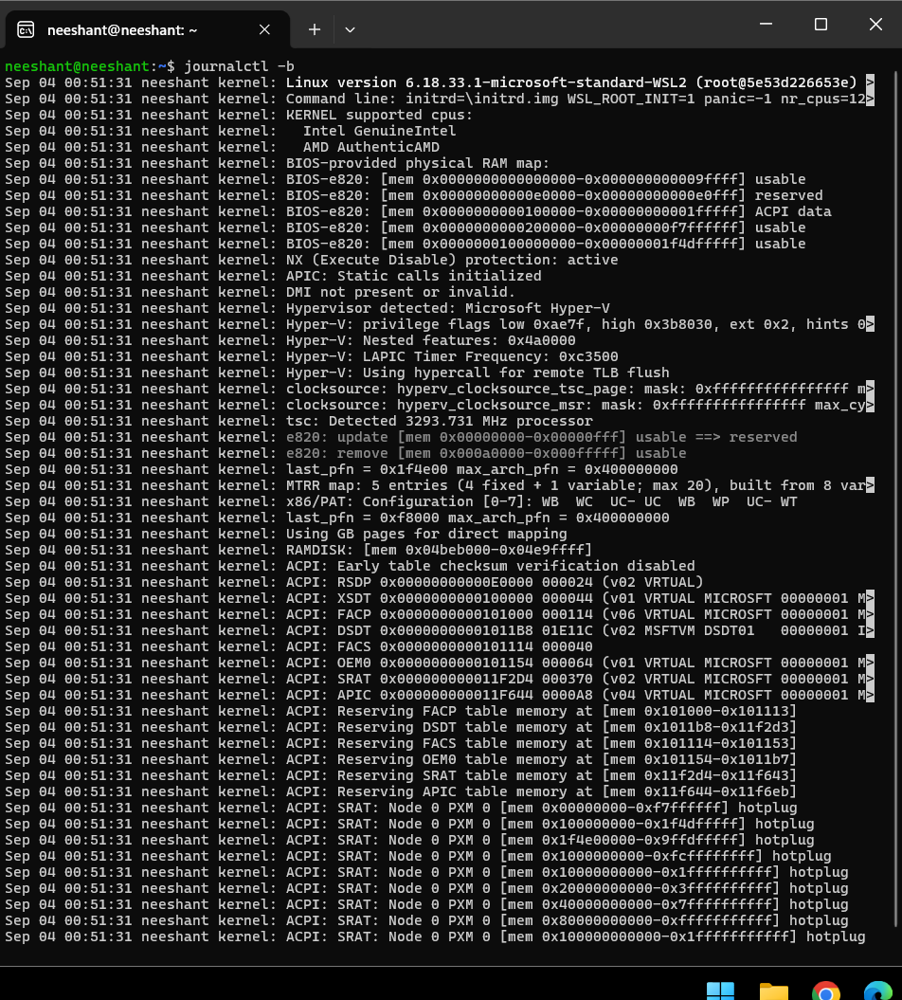
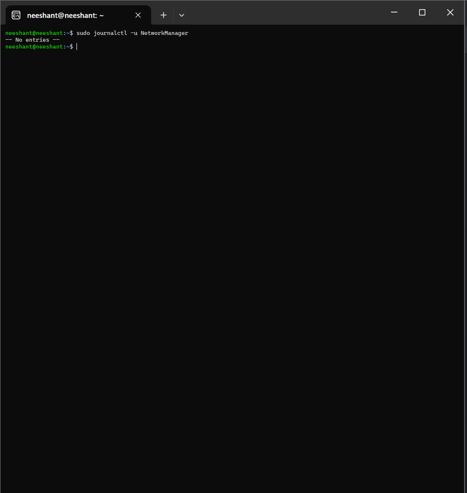

# Session 2 — Linux Homework (Tasks 1–4)

## Task 1: Soft Link vs Hard Link

### Concept
- **Hard link:** Another name for the same file. Points directly to the same inode, so both names share the same data. Deleting the original file does NOT destroy the data — the hard link still works.
- **Soft (symbolic) link:** A separate file that points to the original file by path. If the original is deleted/moved, the soft link becomes broken (dangling).

### Commands
```bash
echo "hello linux" > original.txt

# Create links
ln original.txt hardlink.txt        # hard link (same inode)
ln -s original.txt softlink.txt     # soft link (path pointer)

# Verify
ls -li                              # hard link shares inode with original; soft link has its own inode
cat hardlink.txt
cat softlink.txt

# Delete original and observe difference
rm original.txt
cat hardlink.txt                    # still works
cat softlink.txt                    # fails: No such file or directory (broken link)
ls -l                               # soft link shown in red / dangling
```

### Expected Output
```
$ ls -li
1234567 -rw-r--r-- 2 user user 12 ... original.txt
1234567 -rw-r--r-- 2 user user 12 ... hardlink.txt     # same inode
1234568 lrwxrwxrwx 1 user user 12 ... softlink.txt -> original.txt

$ rm original.txt
$ cat hardlink.txt
hello linux
$ cat softlink.txt
cat: softlink.txt: No such file or directory
```

### Screenshot


### Interview notes
- `ln file hardlink` vs `ln -s file softlink`.
- Hard links cannot span filesystems or link directories; soft links can do both.
- `ls -i` shows inodes; `stat <file>` shows link count.

---

## Task 2: `adduser` vs `useradd`

### Concept
- **`useradd`:** Low-level binary. Creates the user but requires manual flags for home dir, shell, password (`-m -s -p`), and does not prompt interactively.
- **`adduser`:** High-level Perl wrapper (Debian/Ubuntu). Interactive — prompts for password and user info (full name, etc.), creates home directory and applies distro defaults automatically.
- **Preferred on Ubuntu:** `adduser` — friendlier, handles setup, fewer mistakes.

### Commands
```bash
# Recommended (Ubuntu/Debian)
sudo adduser testuser

# Verify
id testuser
ls -ld /home/testuser
getent passwd testuser

# Low-level equivalent (for comparison)
sudo useradd -m -s /bin/bash testuser2
sudo passwd testuser2
```

### Expected Output
```
Adding user `testuser' ...
Adding new group `testuser' (1001) ...
Adding new user `testuser' (1001) with group `testuser' ...
Creating home directory `/home/testuser' ...
Copying files from `/etc/skel' ...
New password: ******
Retype new password: ******
passwd: password updated successfully
```

### Screenshot


### Interview notes
- `adduser` = interactive wrapper; `useradd` = low-level, script-friendly.
- On RHEL/CentOS `adduser` is often just a symlink to `useradd`; the distinction matters mostly on Debian/Ubuntu.
- Always verify with `id <user>` and `getent passwd <user>`.

---

## Task 3: `journalctl`

### Concept
`journalctl` queries logs collected by `systemd-journald`: kernel, boot, services, system events. Key for troubleshooting failed services.

### Commands
```bash
journalctl --no-pager | head          # all logs
journalctl -b                         # logs from current boot only
journalctl -u ssh.service --no-pager  # logs for a specific service
journalctl -p err -b                  # errors from current boot
journalctl -f                         # follow (live tail)
journalctl --since "1 hour ago"
```

### Expected Output
```
-- Logs begin at ... --
Oct 03 10:15:01 host systemd[1]: Started OpenBSD Secure Shell server.
Oct 03 10:15:02 host sshd[512]: Server listening on 0.0.0.0 port 22.
```

### Screenshots






### Interview notes
- `journalctl -u <service>`, `-b` (this boot), `-p err` (priority), `-f` (follow), `--since/--until` (time range).
- Check a failed service with `systemctl status <svc>` then `journalctl -u <svc> -b`.

---

## Task 4: Linux Command Cheat Sheet

Reviewed `basic-linux.pdf`, `ad-linux.pdf`, and `Linux Networking Cheat Sheet.pdf` in this folder.

### Core commands practiced
```bash
pwd; ls -la; cd /tmp
mkdir demo && cd demo
touch app.log
echo "hello" > app.log
echo "world" >> app.log
cat app.log
cp app.log backup.log
mv backup.log old.log
rm old.log
ps aux | head
df -h
du -sh .
top            # (interactive)
chmod 644 app.log
chown $USER:$USER app.log
grep "hello" app.log
find . -name "*.log"
history | tail
```

### Expected Output
```bash
$ cat app.log
hello
world
```

### Interview notes
- `>` overwrites, `>>` appends — classic interview question.
- `chmod` (permissions), `chown` (ownership), `grep` (search), `find` (locate files), `ps/df/du` (process/disk usage).
- See PDFs in this directory for the full cheat sheets.
