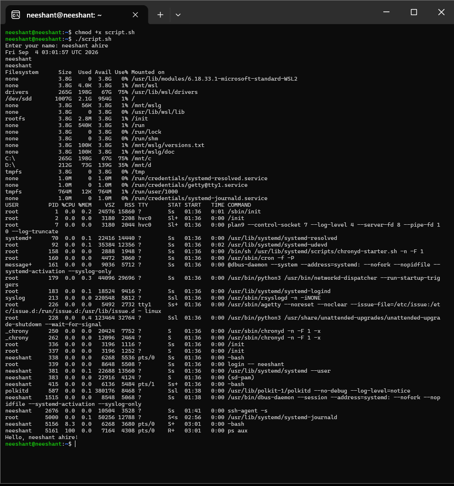

# Shell Scripting Homework Tasks:

## Task:
 - Created a shell script file named script.sh.
 - Contains commands that satisfy the condition of the task

## Script:

[Code for the shell script](script.sh)

```bash
date > output.log
hostname >> output.log
whoami >> output.log
df -h >> output.log
ps aux >> output.log
read -p "Enter your name: " name
echo "Hello, $name!" >> output.log
mkdir test_folder
touch test_folder/test_file.txt
cat output.log
```

### What each line does

| Command | Purpose |
|---|---|
| `date > output.log` | System date/time (truncates log) |
| `hostname >> output.log` | Machine hostname |
| `whoami >> output.log` | Current user |
| `df -h >> output.log` | Disk usage, human-readable |
| `ps aux >> output.log` | Running processes snapshot |
| `read -p ... name` + `echo "Hello, $name!"` | Interactive greeting appended to log |
| `mkdir test_folder` + `touch test_folder/test_file.txt` | Creates `test_folder/test_file.txt` |
| `cat output.log` | Prints the collected log |

Run with `bash script.sh` (note: `read` needs an interactive terminal; in CI pipe a name via `echo "name" | bash script.sh`).

## Screenshot of shell script in running:
- The output for all running process was long. Therefore the first few lines and the last few lines are only captured.




## Output:

[The output of the whole script i.e, output.log](output.log)