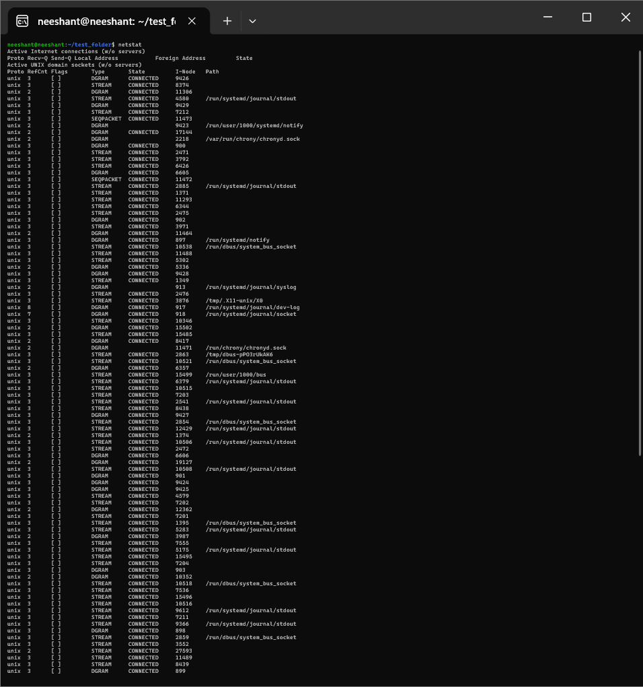

# Session 4 — Networking Homework (Tasks 1–2)

## Task 1: Practice commands and shared repo

Practiced the networking commands from the Linux Networking Cheat Sheet
(`../session2-linux/Linux%20Networking%20Cheat%20Sheet.pdf`) and the repos listed in
`resources.md`. Background notes on IP classes, subnet masks and private ranges are in `ip.md`.

## Task 2: Execute networking commands + screenshots

Each command below was executed and captured. One screenshot per command with a short explanation.

### `ip addr` — show IP addresses of all interfaces
```bash
ip addr
```
Shows IPv4/IPv6 addresses, MAC, MTU and interface state. Start here to find your IP.


### `ip link` — show link-layer (L2) interfaces
```bash
ip link
```
Lists interfaces with MAC addresses and state (`UP`/`DOWN`), without IP details.


### `ip -s link` — link stats
```bash
ip -s link
```
Same as `ip link` plus RX/TX packet, byte and error counters — useful to spot drops/errors.


### `ip route` — show routing table
```bash
ip route
```
Shows the default gateway and per-network routes — explains where packets go next.


### `ip maddr` — multicast addresses
```bash
ip maddr
```
Shows multicast group memberships per interface (used by protocols like OSPF, mDNS).


### `ip neigh` — neighbour (ARP) table
```bash
ip neigh
```
Shows IP-to-MAC mappings learned via ARP/NDP — verifies L2 reachability to neighbours.


### `ip addr add` — assign an IP (demo)
```bash
sudo ip addr add 192.168.1.100/24 dev eth0
ip addr show dev eth0
```
Temporarily assigns an address to an interface. Lost on reboot unless made persistent.


### `ip addr del` — remove an IP (demo)
```bash
sudo ip addr del 192.168.1.100/24 dev eth0
ip addr show dev eth0
```
Removes the address added above — cleanup step for the demo.


### `netstat` — sockets and connections
```bash
netstat -tulpn
```
Lists listening TCP/UDP ports, established connections and owning processes. (`ss -tulpn` is the modern replacement.)



### `ifconfig -a` — legacy interface view
```bash
ifconfig -a
```
Older (`net-tools`) equivalent of `ip addr`; `-a` includes down interfaces. Deprecated in favour of `ip`.


## Interview notes

- Prefer `ip` (iproute2) over `ifconfig`/`netstat` — the latter are deprecated; `ss` replaces `netstat`.
- Debug order: `ip addr` → `ip link` → `ip route` → `ip neigh` → `ping` → `ss/netstat`.
- `ip -s link` counters reveal packet loss; `ip route get <dst>` shows which route a packet takes.
- Changes via `ip addr add/del` are runtime-only; persist via Netplan/NetworkManager config.
