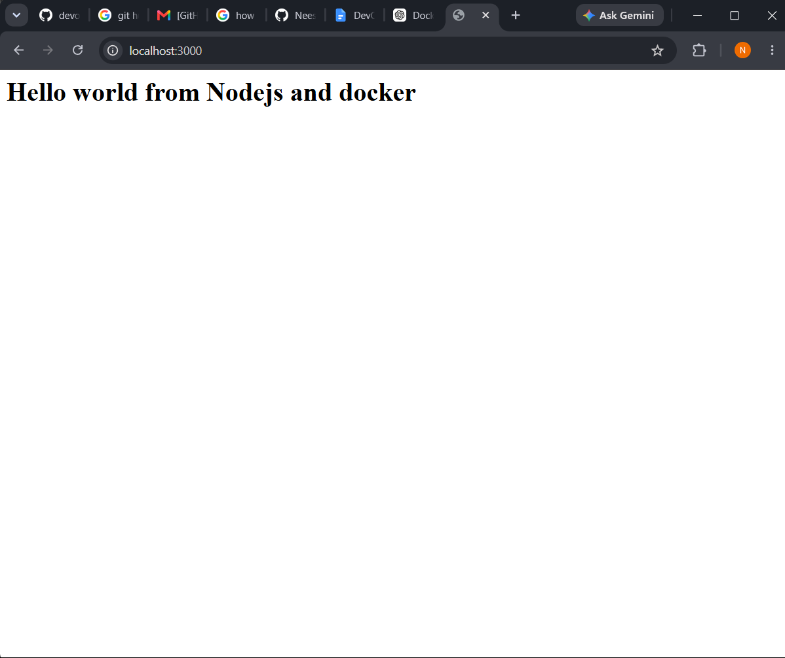
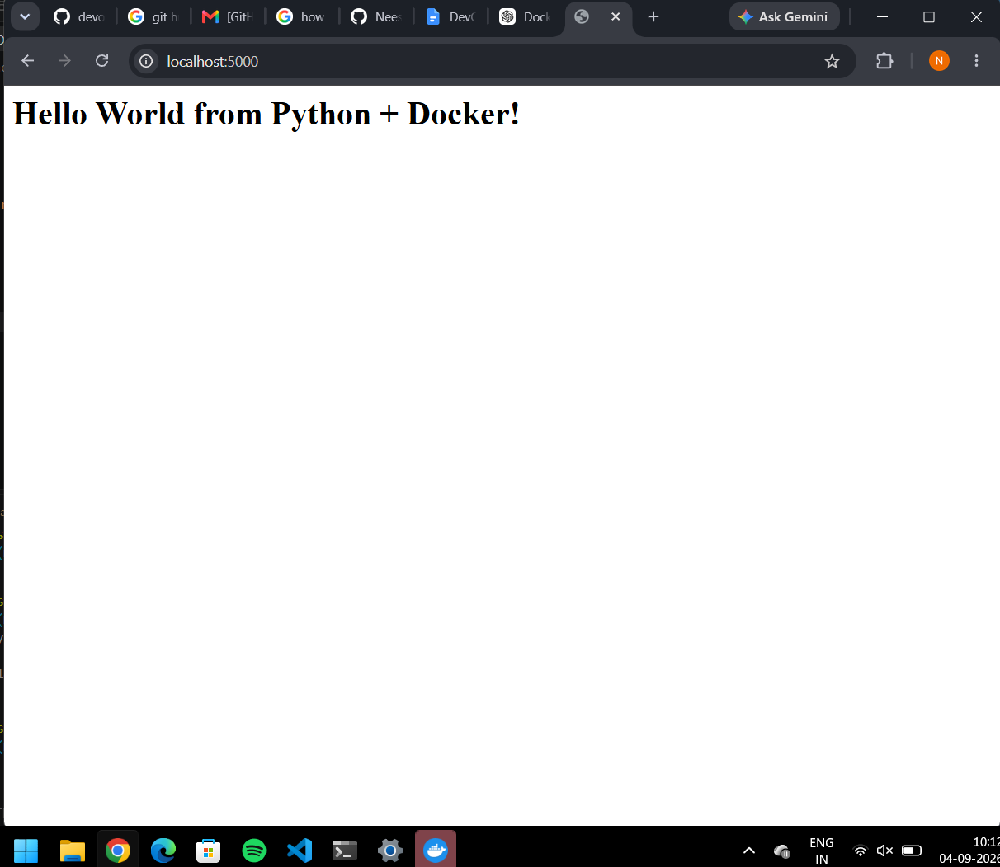
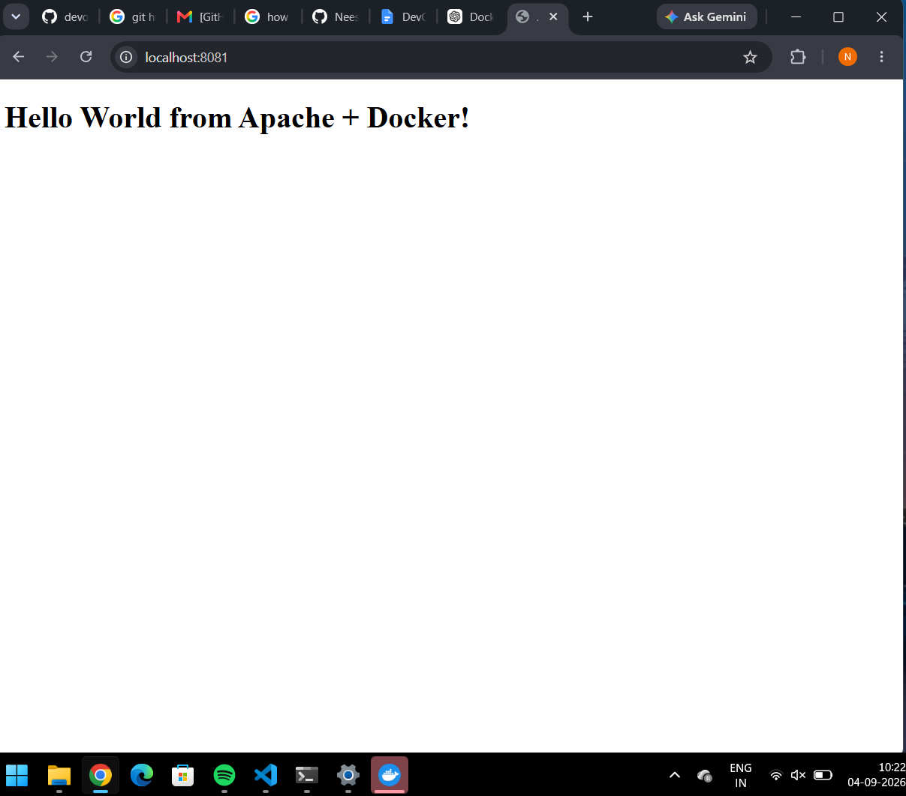
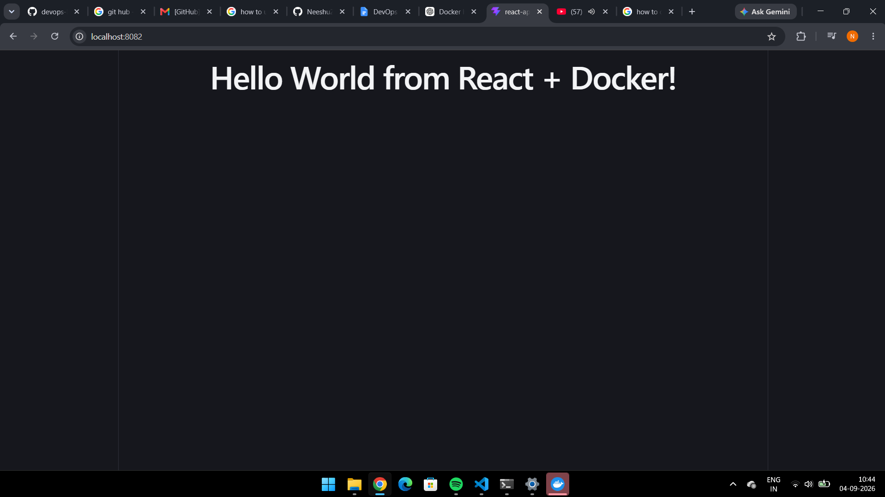
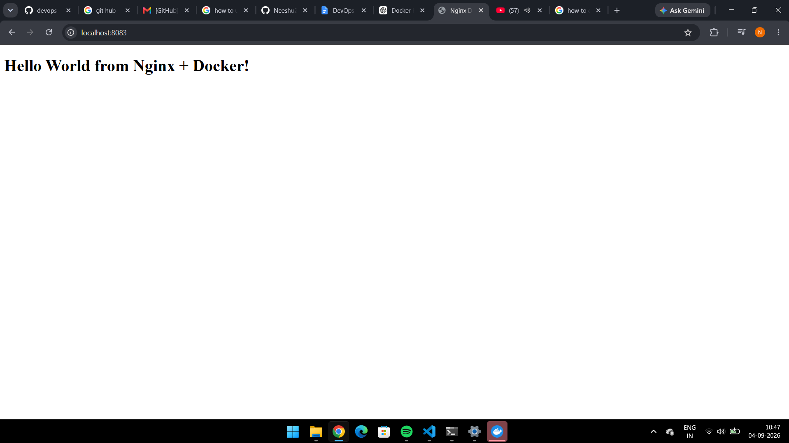
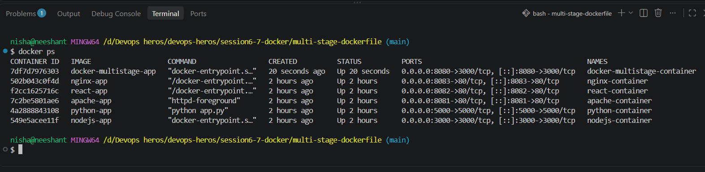

# Session 6–7: Docker Fundamentals + Multi-Stage Build

## Overview

This session covers Docker fundamentals: containerizing polyglot apps
(Node.js, Python, Java, Apache, React, Nginx) and optimizing images with
**multi-stage builds** (Node.js `Hello World from Docker Multi-Stage Build`
app on port 8080).

Contents:

- `docker-homework/` — Dockerfiles + sources for all 6 apps
- `multi-stage-dockerfile/` — 2-stage Node.js build (Task 1–3)
- `docker.md`, `docker-basic-cmd.pdf`, `docker-advance-cmd.pdf`, `docker-interview-qa.pdf` — notes
- `node-app/`, `python-app/`, `nginx-web/`, `docker-compose-app/` — class practice

## Part 1: Docker Homework — 6 Apps

Source: `docker-homework/readme.md`, Dockerfiles in `docker-homework/*/Dockerfile`.

| # | App | Base image | Dockerfile highlights | Run |
|---|-----|-----------|----------------------|-----|
| 1 | nodejs-app | `node:22-alpine` | `WORKDIR /app`, copy `package.json` + `server.js`, `EXPOSE 3000`, `CMD ["npm","start"]` | `docker build -t nodejs-app ./docker-homework/nodejs-app && docker run -p 3000:3000 nodejs-app` |
| 2 | python-app | `python:3.12-slim` | `pip install --no-cache-dir -r requirements.txt`, copy `app.py`, `EXPOSE 5000`, `CMD ["python","app.py"]` | `docker build -t python-app ./docker-homework/python-app && docker run -p 5000:5000 python-app` |
| 3 | java-app | `eclipse-temurin:21-jdk-alpine` | copy `src/Main.java`, `RUN javac Main.java`, `EXPOSE 8080`, `CMD ["java","Main"]` | `docker build -t java-app ./docker-homework/java-app && docker run -p 8080:8080 java-app` |
| 4 | Apache-app | `httpd:2.4-alpine` | `COPY index.html /usr/local/apache2/htdocs/`, `EXPOSE 80` | `docker build -t apache-app ./docker-homework/Apache-app && docker run -p 8080:80 apache-app` |
| 5 | React-app | `node:22-alpine` → `nginx:alpine` (multi-stage) | stage 1 `npm install && npm run build`; stage 2 `COPY --from=build /app/dist /usr/share/nginx/html`, `EXPOSE 80` | `docker build -t react-app ./docker-homework/React-app/react-app && docker run -p 8080:80 react-app` |
| 6 | nginx-app | `nginx:alpine` | `COPY index.html /usr/share/nginx/html/index.html`, `EXPOSE 80` | `docker build -t nginx-app ./docker-homework/nginx-app && docker run -p 8080:80 nginx-app` |

Verify with:

```bash
docker ps
docker images
curl http://localhost:<port>
```

### Screenshots (localhost running apps)

- Node.js:

  

- Python:

  

- Apache:

  

- React:

  

- Nginx:

  

> Java app has a Dockerfile (`docker-homework/java-app/Dockerfile`) but no
> localhost screenshot was saved in `docker-homework/screenshots/`.

## Part 2: Multi-Stage Build (Task 1–3)

Source: `multi-stage-dockerfile/` (`Dockerfile`, `server.js`, `package.json`, `readme.md`).

`server.js` serves `Hello World from Docker Multi-Stage Build!`:

```js
app.get("/", (req, res) => {
  res.send("<h1>Hello World from Docker Multi-Stage Build!</h1>");
});
```

`Dockerfile` (2 stages, both `node:24-alpine`):

```dockerfile
# Stage 1: Build
FROM node:24-alpine AS builder
WORKDIR /app
COPY package*.json ./
RUN npm install
COPY . .

# Stage 2: Production
FROM node:24-alpine AS production
WORKDIR /app
COPY --from=builder /app/package*.json ./
RUN npm install --omit=dev
COPY --from=builder /app/server.js ./
EXPOSE 3000
CMD ["npm", "start"]
```

Why multi-stage: build deps stay in `builder`; final image only has
production deps + `server.js` → smaller, cleaner image.

### Task 1 + Task 2 — run on port 8080 + `docker ps`

```bash
docker build -t multistage-app ./multi-stage-dockerfile
docker run -d -p 8080:3000 --name multistage multistage-app
docker ps
curl http://localhost:8080   # Hello World from Docker Multi-Stage Build!
```

- Running application on port 8080:

  

- docker ps:

  

### Task 3 — nodejs, python, java apps `docker ps`

Re-ran the Part 1 Node.js, Python and Java containers together and verified
with `docker ps` (same screenshot as Task 1/2 in
`multi-stage-dockerfile/screenshots/docker-ps.png`):


Useful cleanup:

```bash
docker stop $(docker ps -q)
docker rm -f $(docker ps -aq)
docker system prune -a
```

See `docker.md` for details.
