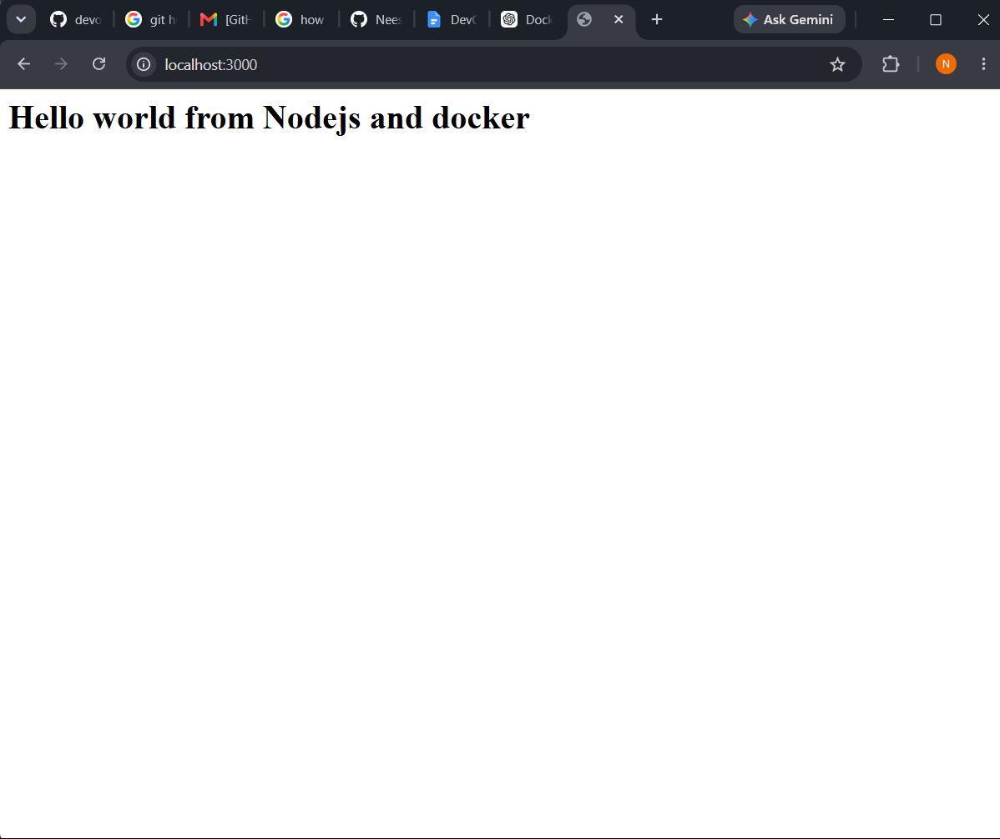
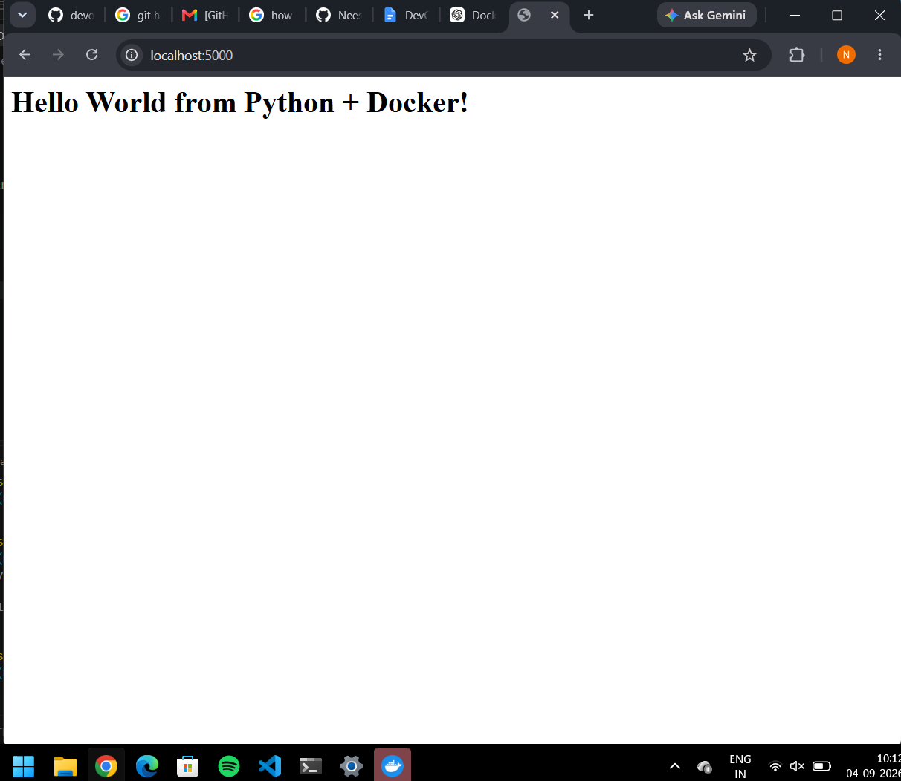
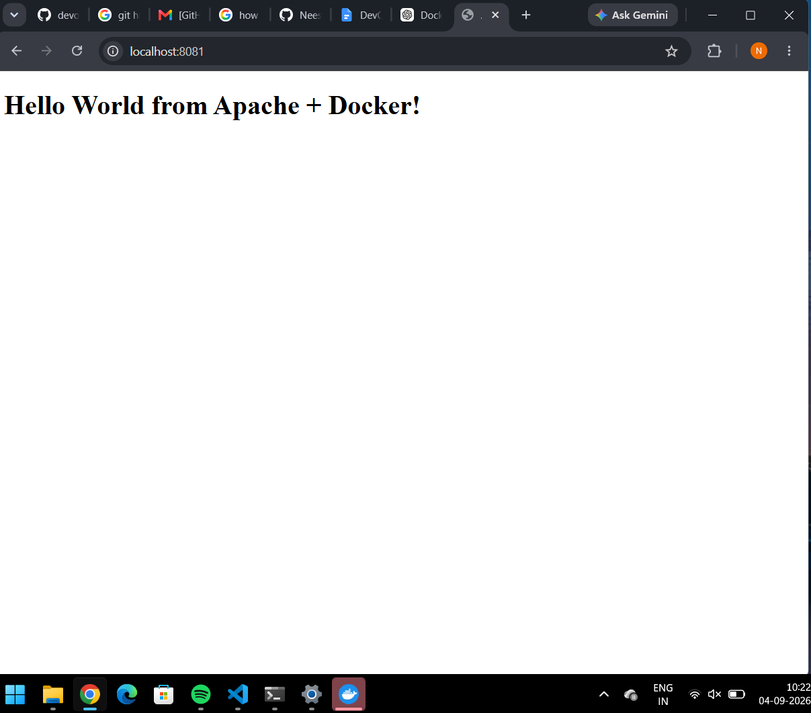
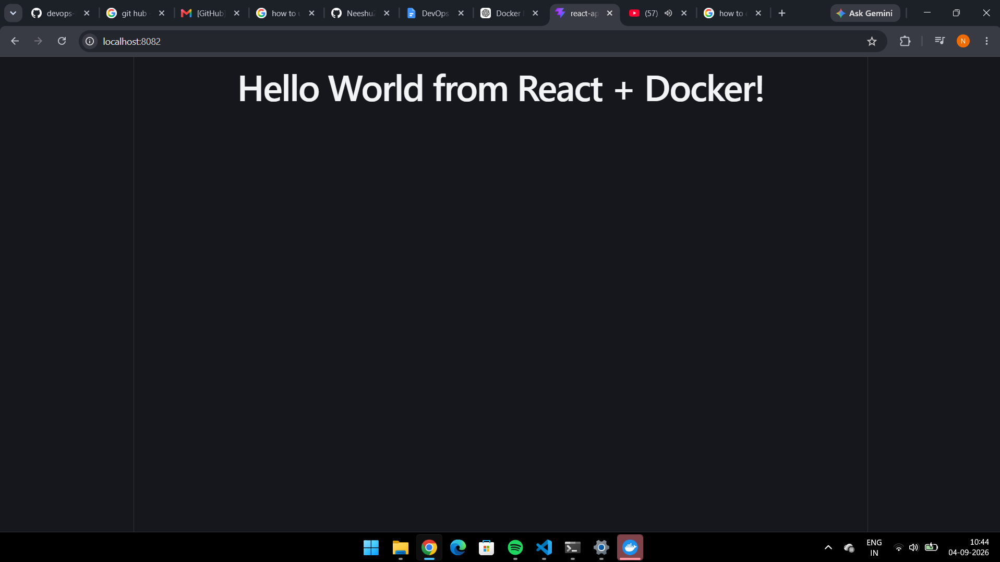
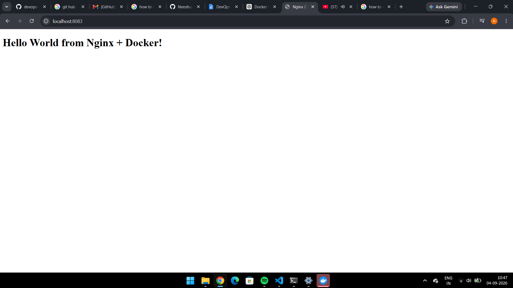

# Docker Fundamentals Homework:

## Task:

### The codes of all the applications are given below:

- [Nodejs](./nodejs-app/)
- [Python](./python-app/)
- [Apache](./Apache-app/)
- [React](./React-app/)
- [Nginx](./nginx-app/)

### Screenshots of localhost running these applications:

- Nodejs:
    

- Python:
    

- Apache:
    

- React:
    

- Nginx:
    